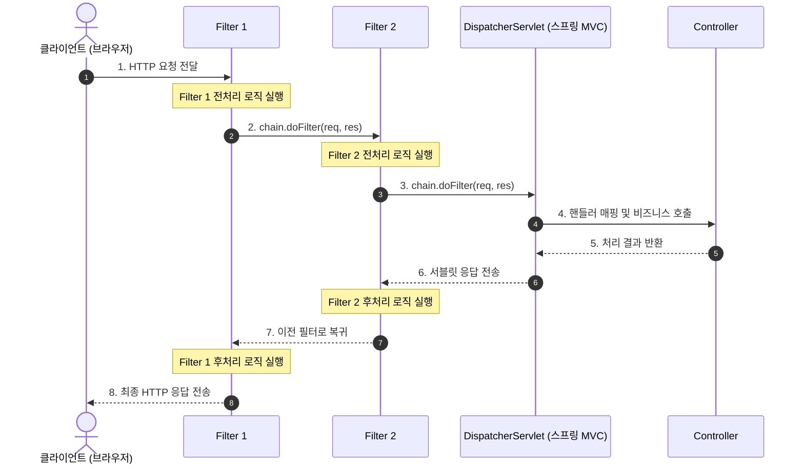

# **OpenAPI 명세와 Swagger 문서화**

## **1. OpenAPI 사양과 Swagger 도구**

- REST API 문서화의 과제와 자동화 필요성
    - 프론트엔드와 백엔드 개발자 간의 협업에서 API 문서는 통신 규약을 정의하는 핵심 계약서 역할을 수행함.
    - 엑셀, 위키, 노션 등에 수기로 작성하는 정적 문서는 비즈니스 로직 및 컨트롤러 코드가 변경될 때마다 갱신이 누락되기 쉬워 실제 코드 동작과 문서 내용이 불일치하는 동기화 문제가 발생.
    - 소스코드의 변경 사항을 실시간으로 감지하여 최신 API 사양 문서를 자동 생성하고 동기화해 주는 문서 자동화 도구 도입 필요.
- OpenAPI Specification(OAS)의 정의와 특징
    - RESTful 웹 서비스 인터페이스를 기술하기 위해 표준화된 언어 독립적 공식 API 사양 규격.
    - HTTP 통신에 필요한 요청 경로, 지원 메서드, 헤더 및 쿼리 파라미터, 입출력 Body 데이터 모델 스키마, 발생 가능한 에러 응답 체계를 JSON 또는 YAML 포맷의 정형화된 메타데이터로 표현함.
    - 사람이 직관적으로 읽고 이해할 수 있을 뿐만 아니라, 컴퓨터 프로그램이 문서를 파싱하여 클라이언트 SDK 코드나 Mock 서버, 테스트 케이스를 자동 생성할 수 있는 기계 판독성(Machine-Readable)을 제공함.
- Swagger와 OpenAPI의 상호 관계
    - Swagger: OpenAPI 사양을 바탕으로 대화형 웹 문서 인터페이스를 생성하고 API 테스트를 지원하는 대표적인 오픈소스 도구.
    - REST API를 기술하는 공식 사양 명칭은 OpenAPI, 이를 시각화하고 가공하는 대표적인 도구 툴킷은 Swagger(Swagger UI, Swagger Editor, Swagger Codegen).
- Spring Boot 생태계의 Springdoc 프레임워크
    - 스프링 부트 환경에서는 `springdoc-openapi` 라이브러리를 표준으로 채택하여 스프링 MVC 컨트롤러의 매핑 어노테이션과 DTO 제약조건을 기반으로 OpenAPI 3.1 사양 문서 및 Swagger UI를 무설정으로 자동 생성함.

## **2. Springdoc OpenAPI 라이브러리 환경 구성**

### **2.1 build.gradle 의존성 설정**

- springdog 참고: https://springdoc.org
- 스프링 부트 환경에서 OpenAPI 사양을 자동으로 분석하여 대화형 웹 인터페이스 문서를 생성하는 Springdoc 라이브러리 추가.

```
dependencies {
    // Springdoc OpenAPI Swagger UI 스타터
    implementation 'org.springdoc:springdoc-openapi-starter-webmvc-ui:3.1.1'
}
```

### **2.2 application.yaml 환경 설정**

- Swagger UI Configuration 참고: https://swagger.io/docs/open-source-tools/swagger-ui/usage/configuration

```yaml
# Springdoc OpenAPI 및 Swagger UI 설정
springdoc:
  # 기본 응답 미디어 타입을 application/json으로 지정
  default-produces-media-type: application/json
  swagger-ui:
    # Swagger UI 엔드포인트 커스텀 경로 설정
    path: /swagger-ui.html
    # 태그 그룹 정렬 기준 (옵션: alpha - 태그명 알파벳/가나다 사전순)
    tags-sorter: alpha
    # 개별 API 엔드포인트 정렬 기준 (옵션: alpha - URI 경로 사전순, method - HTTP 메서드명 알파벳순)
    operations-sorter: alpha
  api-docs:
    # OpenAPI 문서 자동 생성 활성화 및 엔드포인트 경로
    enabled: true
    path: /v3/api-docs
```

## **3. Swagger 어노테이션 기반 API 명세화**

- Swagger 참고: https://swagger.io
- Swagger Annotations 참고: https://github.com/swagger-api/swagger-core/wiki/Swagger-2.X---Annotations

### **3.1 주요 Swagger/OpenAPI 어노테이션 명세**

#### **1) `@Tag`**

- API 컨트롤러 단위의 그룹화 및 설명을 부여.
- `name`: 태그의 고유 식별 명칭(그룹명). Swagger UI 화면에서 아코디언 메뉴의 대분류 제목으로 표시됨 (기본값: "").
- `description`: 해당 API 그룹에 대한 상세 설명 기술 (기본값: "").

```java
@Tag(name = "SNS 게시글 API", description = "게시글 등록, 조회, 수정, 삭제를 담당하는 REST 컨트롤러")
@RestController
@RequestMapping("/api/v1/posts")
public class PostRestController {
    // ...
}
```

#### **2) `@Operation`**

- 개별 API 엔드포인트 메서드의 기능 요약과 세부 처리 방식을 정의.
- `summary`: API 기능에 대한 간결한 한 줄 요약 설명. 엔드포인트 목록 행에 기본 노출됨 (기본값: "").
- `description`: API의 세부 동작 규칙, 사전 조건, 제약 사항 등을 기술하는 상세 설명 (기본값: "").
- `hidden`: true 설정 시 해당 API를 Swagger UI 문서 목록에서 제외하여 비노출 처리함 (기본값: false).
- `deprecated`: true 설정 시 지원 중단 예정인 API임을 취소선 스타일로 시각화함 (기본값: false).

```java
@Operation(
    summary = "게시글 상세 조회",
    description = "기본 키 ID에 해당하는 게시글의 상세 정보를 조회합니다.<br>대상이 존재하지 않을 경우 404 에러를 반환합니다."
)
@GetMapping("/{id}")
public ResponseEntity<PostResponse> getPostDetail(@PathVariable("id") Long id) {
    // ...
}
```

#### **3) `@ApiResponse`**

- 특정 HTTP 응답 상태 코드에 따른 반환 결과와 에러 상황을 명세화.
- `responseCode`: HTTP 응답 상태 코드 지정 (기본값: "default", 일반적인 HTTP 상태 코드 "200", "201", "400", "404" 등을 직접 명시).
- `description`: 해당 상태 코드가 반환되는 구체적인 원인이나 결과 설명 (기본값: "").
- `headers`: 응답과 함께 전달되는 HTTP 응답 헤더 목록을 정의하는 `@Header` 배열 지정 (기본값: 빈 배열. 201 Created 응답의 Location 헤더 등 명세에 활용).
- `content` (기본값: 빈 배열)
    - 응답 본문(Body)의 미디어 타입과 데이터 스키마 구조를 정의하는 `@Content` 객체 지정.
    - 정상 응답: 컨트롤러 메서드의 제네릭 반환 타입(`ResponseEntity<PostResponse>` 등)과 일치하는 경우 스키마가 자동 추론되므로 `content` 생략 가능.
    - 에러 응답: 메서드 시그니처에 명시되지 않는 공통 에러 객체(`ApiErrorResponse`)를 명세할 때 `@Content(schema = @Schema(implementation = ApiErrorResponse.class))` 형태로 지정.
    - 본문 미존재: 204 No Content처럼 응답 바디가 비어 있는 경우 `@Content(schema = @Schema(hidden = true))`로 설정하여 불필요한 스키마 노출 방지.

```java
@ApiResponse(responseCode = "200", description = "성공")
@ApiResponse(
    responseCode = "404",
    description = "게시글이 존재하지 않음",
    content = @Content(schema = @Schema(implementation = ApiErrorResponse.class))
)
@GetMapping("/{id}")
public ResponseEntity<PostResponse> getPostDetail(@PathVariable("id") Long id) {
    // ...
}
```

#### **4) `@ApiResponses`**

- 단일 엔드포인트에서 발생 가능한 여러 HTTP 상태 코드별 응답 명세를 배열 형태로 묶어서 선언하는 컨테이너 어노테이션.
- `value`: 복수의 `@ApiResponse` 어노테이션을 배열(`{ ... }`) 형태로 나열 (기본값: `{}`).

```java
@ApiResponses({
    @ApiResponse(responseCode = "200", description = "성공"),
    @ApiResponse(
        responseCode = "400",
        description = "입력값 유효성 검증 실패",
        content = @Content(schema = @Schema(implementation = ApiErrorResponse.class))
    ),
    @ApiResponse(
        responseCode = "403",
        description = "권한 없음",
        content = @Content(schema = @Schema(implementation = ApiErrorResponse.class))
    ),
    @ApiResponse(
        responseCode = "404",
        description = "대상 게시글이 존재하지 않음",
        content = @Content(schema = @Schema(implementation = ApiErrorResponse.class))
    )
})
@PutMapping("/{id}")
public ResponseEntity<PostResponse> updatePost(
    @PathVariable("id") Long id,
    @Valid @RequestBody PostUpdateRequest request
) {
    // ...
}
```

#### **5) `@Parameter`**

- HTTP 요청 매개변수(경로 변수, 쿼리 스트링, 헤더 등)의 메타데이터와 예시값을 정의.
- `name`: 매개변수의 파라미터 명칭 지정. 생략 시 자바 메서드의 매개변수 변수명이나 스프링 바인딩 어노테이션(`@PathVariable`, `@RequestParam` 등)의 name 속성값을 자동 적용 (기본값: "").
- `description`: 매개변수의 의미와 제약사항 설명 (기본값: "").
- `in`: 매개변수가 위치하는 HTTP 요청 위치 지정 (ParameterIn.QUERY, ParameterIn.PATH, ParameterIn.HEADER 등. 기본값: ParameterIn.DEFAULT, 스프링 어노테이션 바탕으로 자동 추론).
- `required`: 매개변수의 필수 전달 여부 지정 (기본값: false. 단, `@PathVariable` 적용 시 스프링 바인딩 연동에 의해 true로 자동 반영).
- `example`: Swagger UI 테스트 창에 기본으로 채워질 단일 예시값 설정 (기본값: "").

```java
@GetMapping("/{id}")
public ResponseEntity<PostResponse> getPostDetail(
    @Parameter(description = "게시글 id", example = "1", required = true)
    @PathVariable("id") Long id
) {
    // ...
}
```

#### **6) `@ParameterObject`**

- Springdoc 전용 어노테이션으로, `@ModelAttribute`로 바인딩되는 DTO나 Pageable 같은 복합 객체를 Swagger UI 상에서 개별 쿼리 파라미터 필드로 자동 분해하여 명세화.
- DTO 내부 필드에 선언된 `@Schema` 또는 Bean Validation 어노테이션을 자동으로 스캔하여 입력 폼을 구성.

```java
@GetMapping
public ResponseEntity<List<PostResponse>> getPostList(
    @ParameterObject @ModelAttribute PostSearchRequest searchRequest
) {
    // ...
}
```

#### **7) `@Schema`**

- 요청 및 응답 DTO 필드의 데이터 규격, 설명, 제약조건, 예시값을 직접 명세화.
- `description`: 필드의 의미와 용도 설명 (기본값: "").
- `example`: Swagger UI의 JSON 요청/응답 템플릿에 자동 채워질 예시값 지정 (기본값: "").
- `requiredMode`: 필수 입력 여부 지정 (기본값: RequiredMode.AUTO. Bean Validation 어노테이션 기반 자동 추론).
- `nullable`: null 허용 여부 지정 (기본값: false).
- `hidden`: true 설정 시 해당 필드를 OpenAPI 스키마 및 Swagger UI 문서에서 제외하여 비노출 처리함 (기본값: false).

```java
// 요청 DTO 예시 (PostCreateRequest)
public class PostCreateRequest {
    @Schema(hidden = true) // DB 자동 생성
    private Long id;

    @Schema(hidden = true) // 서버 내부에서 주입
    private Long memberId;

    @Schema(description = "게시글 본문 내용", example = "스프링 부트 REST API 학습 중입니다.", requiredMode = Schema.RequiredMode.REQUIRED)
    private String content;

    @Schema(description = "첨부 이미지 URL", example = "https://example.com/images/post1.png", nullable = true)
    private String imageUrl;
}

// 응답 DTO 예시 (PostResponse)
public record PostResponse(
    @Schema(description = "게시글 고유 식별자(PK)", example = "1")
    Long id,

    @Schema(description = "작성자 회원 ID", example = "10")
    Long memberId,

    @Schema(description = "게시글 본문 내용", example = "스프링 부트 REST API 학습 중입니다.")
    String content,

    @Schema(description = "첨부 이미지 URL", example = "https://example.com/images/post1.png", nullable = true)
    String imageUrl,

    @Schema(description = "좋아요 누적 수", example = "0")
    int likeCount,

    @Schema(description = "게시글 등록 일시", example = "2026-08-07T10:00:00")
    LocalDateTime createdAt,

    @Schema(description = "게시글 최종 수정 일시", example = "2026-08-07T10:30:00")
    LocalDateTime updatedAt
) {}
```

### **3.2 컨트롤러에 Swagger 명세 어노테이션 적용**

- src/main/java/net/likelion/bebc25/sns/controller/PostRestController.java
    - 앞서 작성한 PostRestController에 Swagger/OpenAPI 명세 어노테이션을 적용하여 API 문서를 시각화하고 대화형 테스트 환경을 구성함.

    ```java
    package net.likelion.bebc25.sns.controller;
    
    import io.swagger.v3.oas.annotations.Operation;
    import io.swagger.v3.oas.annotations.Parameter;
    import io.swagger.v3.oas.annotations.headers.Header;
    import io.swagger.v3.oas.annotations.media.Content;
    import io.swagger.v3.oas.annotations.media.Schema;
    import io.swagger.v3.oas.annotations.responses.ApiResponse;
    import io.swagger.v3.oas.annotations.responses.ApiResponses;
    import io.swagger.v3.oas.annotations.tags.Tag;
    import jakarta.validation.Valid;
    import net.likelion.bebc25.sns.dto.ApiErrorResponse;
    import net.likelion.bebc25.sns.dto.PostCreateRequest;
    import net.likelion.bebc25.sns.dto.PostResponse;
    import net.likelion.bebc25.sns.dto.PostSearchRequest;
    import net.likelion.bebc25.sns.dto.PostUpdateRequest;
    import net.likelion.bebc25.sns.service.PostService;
    import org.springdoc.core.annotations.ParameterObject;
    import org.springframework.http.HttpStatus;
    import org.springframework.http.ResponseEntity;
    import org.springframework.web.bind.annotation.*;
    
    import java.net.URI;
    import java.util.List;
    
    @Tag(name = "SNS 게시글 API", description = "피드 게시글 등록, 조회, 수정, 삭제를 담당하는 REST 컨트롤러")
    @RestController
    @RequestMapping("/api/v1/posts")
    public class PostRestController {
    
        private final PostService postService;
    
        public PostRestController(PostService postService) {
            this.postService = postService;
        }
    
        @Operation(summary = "게시글 목록 조회 및 검색", description = "검색 키워드 및 정렬 조건에 부합하는 게시글 목록을 반환합니다.")
        @ApiResponse(responseCode = "200", description = "목록 조회 성공")
        @GetMapping
        public ResponseEntity<List<PostResponse>> getPostList(
                @ParameterObject @ModelAttribute PostSearchRequest searchRequest) {
            return ResponseEntity.ok(postService.searchPosts(searchRequest));
        }
    
        @Operation(summary = "게시글 단건 상세 조회", description = "기본 키 ID에 해당하는 게시글의 상세 정보를 조회합니다.")
        @ApiResponses({
            @ApiResponse(responseCode = "200", description = "조회 성공"),
            @ApiResponse(
                responseCode = "404",
                description = "게시글이 존재하지 않음",
                content = @Content(schema = @Schema(implementation = ApiErrorResponse.class))
            )
        })
        @GetMapping("/{id}")
        public ResponseEntity<PostResponse> getPostDetail(
                @Parameter(description = "조회할 게시글 ID", example = "1")
                @PathVariable("id") Long id) {
            return ResponseEntity.ok(postService.getPostById(id));
        }
    
        @Operation(summary = "신규 게시글 등록", description = "회원 ID와 게시글 본문, 이미지 URL을 전달받아 피드에 등록합니다.")
        @ApiResponses({
            @ApiResponse(
                responseCode = "201",
                description = "게시글 생성 성공",
                headers = @Header(name = "Location", description = "생성된 게시글의 상세 조회 URI 경로", schema = @Schema(type = "string"))
            ),
            @ApiResponse(
                responseCode = "400",
                description = "입력값 유효성 검증 실패",
                content = @Content(schema = @Schema(implementation = ApiErrorResponse.class))
            )
        })
        @PostMapping
        public ResponseEntity<PostResponse> createPost(
                @Parameter(description = "작성자 회원 ID", example = "1")
                @RequestHeader("X-Member-Id") Long memberId,
                @Valid @RequestBody PostCreateRequest request) {
            request.setMemberId(memberId); // 임시 헤더의 회원 식별자를 모델(DTO)에 주입
            PostResponse createdPost = postService.createPost(request);
            URI location = URI.create("/api/v1/posts/" + createdPost.id());
            return ResponseEntity.created(location).body(createdPost);
        }
    
        @Operation(summary = "게시글 수정", description = "게시글 ID와 수정할 본문 내용을 전달받아 데이터를 갱신합니다.")
        @ApiResponses({
            @ApiResponse(responseCode = "200", description = "게시글 수정 성공"),
            @ApiResponse(
                responseCode = "400",
                description = "입력값 유효성 검증 실패",
                content = @Content(schema = @Schema(implementation = ApiErrorResponse.class))
            ),
            @ApiResponse(
                responseCode = "403",
                description = "본인 작성 게시글이 아니므로 수정 권한 없음",
                content = @Content(schema = @Schema(implementation = ApiErrorResponse.class))
            ),
            @ApiResponse(
                responseCode = "404",
                description = "수정할 대상 게시글이 존재하지 않음",
                content = @Content(schema = @Schema(implementation = ApiErrorResponse.class))
            )
        })
        @PutMapping("/{id}")
        public ResponseEntity<PostResponse> updatePost(
                @Parameter(description = "작성자 회원 ID", example = "1")
                @RequestHeader("X-Member-Id") Long memberId,
                @Parameter(description = "수정할 게시글 ID", example = "1")
                @PathVariable("id") Long id,
                @Valid @RequestBody PostUpdateRequest request) {
            PostResponse post = postService.getPostById(id);
            if (!post.memberId().equals(memberId)) {
                return ResponseEntity.status(HttpStatus.FORBIDDEN).build();
            }
            postService.updatePost(id, request);
            PostResponse updatedPost = postService.getPostById(id);
            return ResponseEntity.ok(updatedPost);
        }
    
        @Operation(summary = "게시글 삭제", description = "게시글 ID를 전달받아 해당 자원을 삭제합니다.")
        @ApiResponses({
            @ApiResponse(
                responseCode = "204",
                description = "게시글 삭제 완료",
                content = @Content(schema = @Schema(hidden = true))
            ),
            @ApiResponse(
                responseCode = "403",
                description = "본인 작성 게시글이 아니므로 삭제 권한 없음",
                content = @Content(schema = @Schema(implementation = ApiErrorResponse.class))
            ),
            @ApiResponse(
                responseCode = "404",
                description = "삭제할 대상 게시글이 존재하지 않음",
                content = @Content(schema = @Schema(implementation = ApiErrorResponse.class))
            )
        })
        @DeleteMapping("/{id}")
        public ResponseEntity<Void> deletePost(
                @Parameter(description = "작성자 회원 ID", example = "1")
                @RequestHeader("X-Member-Id") Long memberId,
                @Parameter(description = "삭제할 게시글 ID", example = "1")
                @PathVariable("id") Long id) {
            PostResponse post = postService.getPostById(id);
            if (!post.memberId().equals(memberId)) {
                return ResponseEntity.status(HttpStatus.FORBIDDEN).build();
            }
            postService.deletePost(id);
            return ResponseEntity.noContent().build();
        }
    }
    ```


## **4. Swagger UI 대화형 API 테스트**

- 애플리케이션 실행 후 웹 브라우저에서 `http://localhost:8080/swagger-ui.html` 또는 `http://localhost:8080/swagger-ui/index.html`로 접속.
- 브라우저 상에서 모든 API 엔드포인트의 명세, Request Body 구조, Response 예시를 시각적으로 확인하고 'Try it out' 버튼을 통해 실시간 API 호출 테스트.

# **웹 보안 기초와 서블릿 필터 아키텍처**

## **1. 웹 애플리케이션 보안과 공통 관심사 분리**

- 현대 웹 애플리케이션은 개방된 인터넷 네트워크망을 통해 전 세계 사용자의 HTTP 요청을 수신함.
- 악의적인 공격자나 권한이 없는 사용자가 서비스의 민감한 자원에 접근하는 것을 원천 차단하고, 정상적인 사용자에게만 허용된 기능을 제공하는 보안 체계 구축이 필수.

### **1.1 인증(Authentication)과 인가(Authorization)의 정의 및 차이**

#### **1) 인증(Authentication)**

- 시스템에 접근하는 주체(User, Client)가 주장하는 본인이 맞는지 신원을 신뢰성 있게 증명하고 확인하는 절차.
- 일상생활의 신분증 제시 또는 여권 검사와 동일한 성격을 지님.
- 사용자가 제공한 식별자(아이디, 이메일)와 검증 수단(비밀번호, 생체 정보, 일회용 OTP)을 대조하여 시스템이 사용자의 신원을 확정하는 과정.

#### **2) 인가(Authorization)**

- 신원이 확인된 인증 주체에게 특정 시스템 자원(URI, 비즈니스 메서드, 데이터베이스 행)에 접근하거나 작업을 수행할 수 있는 구체적인 권한이 부여되어 있는지 검증하는 절차.
- 건물 출입증을 발급받은 방문객이라 하더라도 통제 구역인 서버실이나 임원실에는 들어갈 수 없도록 제한하는 보안 통제와 유사.
- 일반 회원(ROLE_USER)은 게시글 열람 및 작성이 가능하지만, 시스템 설정 변경이나 타인의 계정 정지는 관리자(ROLE_ADMIN) 권한을 보유한 주체에게만 인가됨.

#### **3) 인증과 인가의 상관관계**

- 보안 처리 흐름상 반드시 인증이 선행되어야만 그 주체의 권한을 조회하여 인가를 판별할 수 있음.
- 인증되지 않은 사용자는 익명 사용자(Anonymous User)로 취급되며, 공개된 자원에만 접근이 허용됨.

### **1.2 서블릿 컨테이너 레벨 보안의 필요성**

- 보안 로직을 비즈니스 컨트롤러 내부에서 직접 검증하는 방식의 구조적 결함
    - 각 컨트롤러 메서드마다 `if (session.getUser() == null)` 또는 권한 검사 코드를 중복 작성하게 됨.
    - 개발자의 단순 실수로 단 하나의 엔드포인트에서 검증을 누락할 경우 치명적인 보안 취약점이 발생함.
    - 보안이라는 횡단 관심사(Cross-Cutting Concerns)가 순수한 비즈니스 로직과 강하게 결합하여 코드 유지보수성이 급격히 저하됨.
- 서블릿 컨테이너 계층에서의 선제적 차단 원리
    - 클라이언트 요청이 Spring MVC의 핵심 진입점인 `DispatcherServlet`에 도달하기도 전에 앞단에서 요청을 가로챔.
    - 인증되지 않거나 권한이 없는 비정상 요청을 가장 바깥 외벽(서블릿 컨테이너)에서 즉각 거부함으로써 불필요한 컨트롤러 파라미터 바인딩 및 데이터베이스 조회를 차단하고 시스템 자원을 보호함.

## **2. 서블릿 필터의 동작 메커니즘**

- 서블릿 필터(Servlet Filter)는 자바 표준 스펙(Jakarta Servlet Specification)에 정의된 기술로, 클라이언트 요청이 서블릿에 도달하기 전과 서블릿이 응답을 클라이언트에 전송하기 전에 요청/응답 객체를 검사하고 변조할 수 있는 인터셉팅 컴포넌트.

### **2.1 Filter 인터페이스 규격과 생명주기**

- 서블릿 컨테이너는 웹 애플리케이션 시작 시점에 필터 인스턴스를 생성하고 초기화한 뒤, 매 HTTP 요청마다 필터 메서드를 호출함.

```java
package jakarta.servlet;

import java.io.IOException;

public interface Filter {

    default void init(FilterConfig filterConfig) throws ServletException {
        // 필터 인스턴스 생성 직후 서블릿 컨테이너에 의해 1회 호출되어 초기화 작업을 수행함
    }

    void doFilter(ServletRequest request, ServletResponse response, FilterChain chain)
            throws IOException, ServletException;

    default void destroy() {
        // 웹 애플리케이션 종료 또는 필터 제거 시 서블릿 컨테이너에 의해 1회 호출되어 자원을 해제함
    }
}
```

- `init(FilterConfig filterConfig)`: 필터 초기화 단계로, 서블릿 컨테이너가 구동될 때 단 한 번 실행되어 환경설정 값을 읽어 들임.
- `doFilter(ServletRequest request, ServletResponse response, FilterChain chain)`: 실제 보안 및 공통 처리가 일어나는 핵심 메서드로, 클라이언트의 요청이 들어올 때마다 매번 호출됨.
- `destroy()`: 필터 종료 단계로, 컨테이너가 내려갈 때 호출되어 캐시 비우기 등 자원 정리를 담당함.

### **2.2 FilterChain 객체의 연속 호출 원리와 전처리/후처리 흐름**

- 서블릿 필터는 단독으로 존재하지 않고 여러 개의 필터가 체인(Chain) 형태로 사슬처럼 엮여 순차 실행되는 Chain of Responsibility 패턴으로 동작함.
- `chain.doFilter(request, response)` 호출을 기점으로 실행 흐름이 전처리와 후처리로 명확히 분기됨.



- 전처리 구간: `chain.doFilter()`를 호출하기 전 라인에 작성된 코드로, 요청 헤더 검증, 인증 토큰 유효성 검사, 요청 로깅 등을 수행함. 만약 검증에 실패하면 `chain.doFilter()`를 호출하지 않고 바로 클라이언트로 응답을 해서 흐름을 끊어버림.
- 체인 위임: `chain.doFilter()`가 실행되면 다음 순번의 필터로 제어권이 넘어가며, 체인의 마지막 필터인 경우 비로소 목적지 서블릿(`DispatcherServlet`)이 호출됨.
- 후처리 구간: `chain.doFilter()` 호출 이후 라인에 작성된 코드로, 서블릿 처리가 완료되고 응답이 되돌아오는 시점에 실행되어 응답 헤더 추가, 응답 바디 압축, 처리 시간 측정 등을 수행함.

### **2.3 서블릿 필터와 스프링 인터셉터(HandlerInterceptor)의 계층 및 실행 시점 비교**

- 스프링 MVC 단원의 인터셉터 참고
- 두 기술 모두 횡단 관심사를 가로채는 역할을 하지만, 동작하는 컨테이너 환경과 제어 범위에서 차이를 보임.

| **비교 기준** | **서블릿 필터 (Servlet Filter)** | **스프링 인터셉터 (HandlerInterceptor)** |
| --- | --- | --- |
| 관리 주체 | 웹 서블릿 컨테이너 (Tomcat, Jetty 등) | 스프링 MVC 프레임워크 (ApplicationContext) |
| 실행 위치 | DispatcherServlet 도달 전/후 (외벽) | DispatcherServlet 통과 후 컨트롤러 직전/직후 (내부) |
| 요청/응답 객체 조작 | ServletRequest/Response 래핑 및 교체 가능 | Request/Response 객체 교체 불가능, 내부 값 조회 위주 |
| 스프링 컨텍스트 접근 | DelegatingFilterProxy를 통해 스프링 빈 연동 가능 | 스프링 빈에 자연스럽게 의존성 주입 가능 |
| 주 활용 분야 | 전역 보안 인증/인가, CORS 7 , 인코딩 변환, 공통 암호화 | 세부 컨트롤러 파라미터 가공, 뷰 렌더링 제어, 세부 권한 로깅 |

## **3. Spring Security 서블릿 필터 체인 연동 구조**

- 서블릿 컨테이너의 필터는 서블릿 스펙에 의해 구동되므로, 원칙적으로 스프링의 IoC 컨테이너가 관리하는 빈(Bean)들을 직접 주입받아 활용하기 어려움.
- Spring Security는 이 이종 컨테이너 간의 결합 문제를 해결하기 위해 프록시 메커니즘을 적용함.

### **3.1 서블릿 컨테이너와 스프링 빈을 이어주는 DelegatingFilterProxy 메커니즘**

- `DelegatingFilterProxy`: 서블릿 컨테이너의 표준 필터 인터페이스를 구현한 프록시 객체.
- 웹 애플리케이션 초기화 시 서블릿 필터로 등록되지만, 스스로 보안 로직을 수행하지 않고 스프링 루트 애플리케이션 컨텍스트 내부에서 `springSecurityFilterChain`이라는 이름의 스프링 빈을 검색하여 모든 작업을 해당 빈에 위임(Delegate)함.
- 이 프록시 구조 덕분에 모든 보안 필터 컴포넌트가 스프링 빈으로 등록되어 `@Autowired` 등 스프링의 강력한 의존성 주입과 라이프사이클 관리를 그대로 누릴 수 있게 됨.

### **3.2 보안 필터 목록을 총괄 제어하는 FilterChainProxy와 SecurityFilterChain 매핑 구조**

- `FilterChainProxy`: `springSecurityFilterChain`이라는 빈 이름으로 등록되는 실질적인 보안 총괄 관리자.
- `SecurityFilterChain`: 여러 개의 세부 보안 필터(`CsrfFilter`, `UsernamePasswordAuthenticationFilter`, `AuthorizationFilter` 등)를 하나의 체인으로 묶어둔 컨테이너 인터페이스.
- `FilterChainProxy`는 클라이언트의 HTTP 요청 URL 경로와 HTTP 메서드를 확인하고, 등록된 여러 `SecurityFilterChain` 중에서 가장 일치하는 체인을 찾아 그 체인 내부에 포함된 보안 필터들을 순차적으로 실행시킴.

```
[HTTP 요청]
    ↓
(서블릿 컨테이너: Tomcat)
    ↓
[표준 서블릿 필터 체인]
    ↓
[DelegatingFilterProxy] (서블릿 스펙 필터)
    ↓ (위임: springSecurityFilterChain 빈 조회)
[FilterChainProxy] (Spring Security 총괄 관리 빈)
    ↓ (URL 매칭 및 체인 선택)
[SecurityFilterChain]
    ├── SecurityContextHolderFilter
    ├── CorsFilter
    ├── CsrfFilter
    ├── LogoutFilter
    ├── UsernamePasswordAuthenticationFilter (또는 커스텀 JWT 필터)
    ├── ExceptionTranslationFilter
    └── AuthorizationFilter
    ↓
[DispatcherServlet] (Spring MVC)
    ↓
[Controller]
```

## **4. Spring Boot 환경의 보안 설정 구성**

- Spring Boot 환경에서는 `SecurityFilterChain`을 반환하는 `@Bean` 메서드를 직접 등록하여 보안 정책을 구성함.

### **4.1 SecurityFilterChain 빈(Bean) 등록 기본 구조**

- build.gradle 의존성 추가 (build.gradle)

```
dependencies {
    implementation 'org.springframework.boot:spring-boot-starter-security'
    implementation 'org.springframework.boot:spring-boot-starter-web'
}
```

- DSL 기반 SecurityConfig 설정 클래스 (src/main/java/net/likelion/bebc25/sns/security/config/SecurityConfig.java)

```java
package net.likelion.bebc25.sns.security.config;

import org.springframework.context.annotation.Bean;
import org.springframework.context.annotation.Configuration;
import org.springframework.security.config.annotation.web.builders.HttpSecurity;
import org.springframework.security.config.annotation.web.configuration.EnableWebSecurity;
import org.springframework.security.config.annotation.web.configurers.AbstractHttpConfigurer;
import org.springframework.security.config.http.SessionCreationPolicy;
import org.springframework.security.web.SecurityFilterChain;

@Configuration
@EnableWebSecurity
public class SecurityConfig {

    @Bean
    public SecurityFilterChain securityFilterChain(HttpSecurity http) throws Exception {
        http
            // 1. CSRF 공격 방어 기능 비활성화 (REST API 환경에서는 JWT 기반 무상태 통신을 하므로 비활성화)
            .csrf(AbstractHttpConfigurer::disable)

            // 2. HTTP 기본 인증(브라우저 팝업 형태) 및 기본 폼 로그인 비활성화
            .httpBasic(AbstractHttpConfigurer::disable)
            .formLogin(AbstractHttpConfigurer::disable)

            // 3. 세션 관리 정책을 무상태(STATELESS)로 지정하여 서버 세션을 생성하거나 유지하지 않음
            .sessionManagement(session -> session
                .sessionCreationPolicy(SessionCreationPolicy.STATELESS)
            )

            // 4. URL 엔드포인트별 접근 인가 설정
            .authorizeHttpRequests(auth -> auth
                .requestMatchers("/api/v1/auth/**", "/swagger-ui/**", "/v3/api-docs/**").permitAll()
                .requestMatchers("/api/v1/admin/**").hasRole("ADMIN")
                .anyRequest().authenticated()
            );

        return http.build();
    }
}
```

### **4.2 기본 보안 정책 제어 원리**

- `csrf(AbstractHttpConfigurer::disable)`: CSRF 10 (Cross-Site Request Forgery)는 브라우저의 자동 쿠키 전송 특성을 악용하는 웹 공격 기법. 서버 세션을 유지하지 않는 무상태(Stateless) REST API 환경에서는 브라우저 세션 쿠키를 통한 자동 인증에 의존하지 않으므로 기본 CSRF 방어를 해제함.
- `httpBasic(AbstractHttpConfigurer::disable)`: HTTP 표준 Basic 인증(헤더에 Base64로 ID/비밀번호 전달) 및 브라우저 기본 인증 팝업창 호출을 비활성화함. REST API 환경에서는 별도의 토큰 인증 방식을 사용하므로 불필요.
- `formLogin(AbstractHttpConfigurer::disable)`: Spring Security 기본 제공 HTML 로그인 페이지(`/login`) 및 세션 기반 폼 로그인 처리를 비활성화함. 클라이언트(React, 모바일 앱 등)가 독립된 로그인 화면과 REST API를 통해 인증을 진행하므로 서버 측 폼 렌더링 기능을 끔.
- `sessionManagement(STATELESS)`: 스프링 시큐리티가 `HttpSession`을 생성하지도 않고, 기존 세션이 존재하더라도 이를 활용하여 `SecurityContext`를 복원하지 않도록 설정함. 모든 요청이 독립적인 인증 정보를 소지해야 함.
- `authorizeHttpRequests`
    - `requestMatchers`: 보호 또는 허용할 URL 패턴이나 HTTP 메서드를 지정하여 인가 규칙의 대상을 선언.
    - `anyRequest`: 앞서 선언한 특정 패턴에 매칭되지 않은 나머지 모든 요청을 포괄 지정하며, 항상 인가 체인의 가장 마지막 순번에 배치해야 함.
    - `permitAll`: 로그인 인증 여부와 무관하게 모든 사용자(익명 사용자 포함)의 접근을 허용함.
    - `hasRole`: 특정 역할을 부여받은 사용자만 접근을 허용하며, 스프링 시큐리티가 내부적으로 `ROLE_` 접두사를 자동으로 덧붙여 권한을 검사함.
    - `authenticated`: 세부 권한의 종류와 상관없이 로그인을 통해 신원이 검증된 인증 사용자에게만 접근을 허용함.