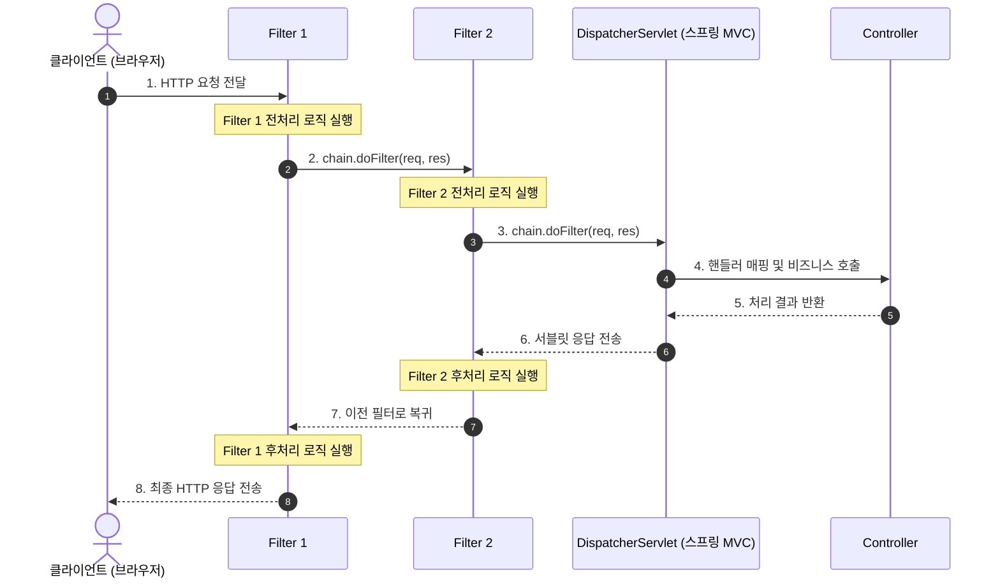
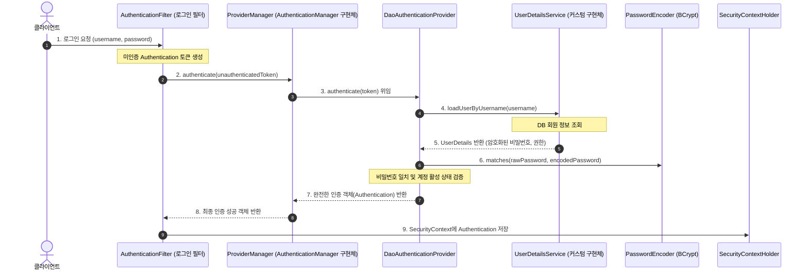

# **웹 보안 기초와 서블릿 필터 아키텍처**

## **1. 웹 애플리케이션 보안과 공통 관심사 분리**

- 현대 웹 애플리케이션은 개방된 인터넷 네트워크망을 통해 전 세계 사용자의 HTTP 요청을 수신함.
- 악의적인 공격자나 권한이 없는 사용자가 서비스의 민감한 자원에 접근하는 것을 원천 차단하고, 정상적인 사용자에게만 허용된 기능을 제공하는 보안 체계 구축이 필수.

### **1.1 인증(Authentication)과 인가(Authorization)의 정의 및 차이**

#### **1) 인증(Authentication)**

- 시스템에 접근하는 주체(User, Client)가 주장하는 본인이 맞는지 신원을 신뢰성 있게 증명하고 확인하는 절차.
- 일상생활의 신분증 제시 또는 여권 검사와 동일한 성격을 지님.
- 사용자가 제공한 식별자(아이디, 이메일)와 검증 수단(비밀번호, 생체 정보, 일회용 OTP)을 대조하여 시스템이 사용자의 신원을 확정하는 과정.

#### **2) 인가(Authorization)**

- 신원이 확인된 인증 주체에게 특정 시스템 자원(URI, 비즈니스 메서드, 데이터베이스 행)에 접근하거나 작업을 수행할 수 있는 구체적인 권한이 부여되어 있는지 검증하는 절차.
- 건물 출입증을 발급받은 방문객이라 하더라도 통제 구역인 서버실이나 임원실에는 들어갈 수 없도록 제한하는 보안 통제와 유사.
- 일반 회원(ROLE_USER)은 게시글 열람 및 작성이 가능하지만, 시스템 설정 변경이나 타인의 계정 정지는 관리자(ROLE_ADMIN) 권한을 보유한 주체에게만 인가됨.

#### **3) 인증과 인가의 상관관계**

- 보안 처리 흐름상 반드시 인증이 선행되어야만 그 주체의 권한을 조회하여 인가를 판별할 수 있음.
- 인증되지 않은 사용자는 익명 사용자(Anonymous User)로 취급되며, 공개된 자원에만 접근이 허용됨.

### **1.2 서블릿 컨테이너 레벨 보안의 필요성**

- 보안 로직을 비즈니스 컨트롤러 내부에서 직접 검증하는 방식의 구조적 결함
    - 각 컨트롤러 메서드마다 `if (session.getUser() == null)` 또는 권한 검사 코드를 중복 작성하게 됨.
    - 개발자의 단순 실수로 단 하나의 엔드포인트에서 검증을 누락할 경우 치명적인 보안 취약점이 발생함.
    - 보안이라는 횡단 관심사(Cross-Cutting Concerns 1 )가 순수한 비즈니스 로직과 강하게 결합하여 코드 유지보수성이 급격히 저하됨.
- 서블릿 컨테이너 계층에서의 선제적 차단 원리
    - 클라이언트 요청이 Spring MVC의 핵심 진입점인 `DispatcherServlet` 에 도달하기도 전에 앞단에서 요청을 가로챔.
    - 인증되지 않거나 권한이 없는 비정상 요청을 가장 바깥 외벽(서블릿 컨테이너)에서 즉각 거부함으로써 불필요한 컨트롤러 파라미터 바인딩 및 데이터베이스 조회를 차단하고 시스템 자원을 보호함.

## **2. 서블릿 필터의 동작 메커니즘**

- 서블릿 필터(Servlet Filter)는 자바 표준 스펙(Jakarta Servlet Specification)에 정의된 기술로, 클라이언트 요청이 서블릿에 도달하기 전과 서블릿이 응답을 클라이언트에 전송하기 전에 요청/응답 객체를 검사하고 변조할 수 있는 인터셉팅 컴포넌트.

### **2.1 Filter 인터페이스 규격과 생명주기**

- 서블릿 컨테이너는 웹 애플리케이션 시작 시점에 필터 인스턴스를 생성하고 초기화한 뒤, 매 HTTP 요청마다 필터 메서드를 호출함.

```java
package jakarta.servlet;

import java.io.IOException;

public interface Filter {

    default void init(FilterConfig filterConfig) throws ServletException {
        // 필터 인스턴스 생성 직후 서블릿 컨테이너에 의해 1회 호출되어 초기화 작업을 수행함
    }

    void doFilter(ServletRequest request, ServletResponse response, FilterChain chain)
            throws IOException, ServletException;

    default void destroy() {
        // 웹 애플리케이션 종료 또는 필터 제거 시 서블릿 컨테이너에 의해 1회 호출되어 자원을 해제함
    }
}
```

- `init(FilterConfig filterConfig)`: 필터 초기화 단계로, 서블릿 컨테이너가 구동될 때 단 한 번 실행되어 환경설정 값을 읽어 들임.
- `doFilter(ServletRequest request, ServletResponse response, FilterChain chain)`: 실제 보안 및 공통 처리가 일어나는 핵심 메서드로, 클라이언트의 요청이 들어올 때마다 매번 호출됨.
- `destroy()`: 필터 종료 단계로, 컨테이너가 내려갈 때 호출되어 캐시 비우기 등 자원 정리를 담당함.

### **2.2 FilterChain 객체의 연속 호출 원리와 전처리/후처리 흐름**

- 서블릿 필터는 단독으로 존재하지 않고 여러 개의 필터가 체인(Chain) 형태로 사슬처럼 엮여 순차 실행되는 Chain of Responsibility 패턴으로 동작함.
- `chain.doFilter(request, response)` 호출을 기점으로 실행 흐름이 전처리와 후처리로 명확히 분기됨.



- 전처리 구간: `chain.doFilter()`를 호출하기 전 라인에 작성된 코드로, 요청 헤더 검증, 인증 토큰 유효성 검사, 요청 로깅 등을 수행함. 만약 검증에 실패하면 `chain.doFilter()`를 호출하지 않고 바로 클라이언트로 응답을 해서 흐름을 끊어버림.
- 체인 위임: `chain.doFilter()`가 실행되면 다음 순번의 필터로 제어권이 넘어가며, 체인의 마지막 필터인 경우 비로소 목적지 서블릿(`DispatcherServlet`)이 호출됨.
- 후처리 구간: `chain.doFilter()` 호출 이후 라인에 작성된 코드로, 서블릿 처리가 완료되고 응답이 되돌아오는 시점에 실행되어 응답 헤더 추가, 응답 바디 압축, 처리 시간 측정 등을 수행함.

### **2.3 서블릿 필터와 스프링 인터셉터(HandlerInterceptor)의 계층 및 실행 시점 비교**

- 스프링 MVC 단원의 인터셉터 참고
- 두 기술 모두 횡단 관심사를 가로채는 역할을 하지만, 동작하는 컨테이너 환경과 제어 범위에서 차이를 보임.

| **비교 기준** | **서블릿 필터 (Servlet Filter)** | **스프링 인터셉터 (HandlerInterceptor)** |
| --- | --- | --- |
| 관리 주체 | 웹 서블릿 컨테이너 (Tomcat, Jetty 등) | 스프링 MVC 프레임워크 (ApplicationContext) |
| 실행 위치 | DispatcherServlet 도달 전/후 (외벽) | DispatcherServlet 통과 후 컨트롤러 직전/직후 (내부) |
| 요청/응답 객체 조작 | ServletRequest/Response 래핑 및 교체 가능 | Request/Response 객체 교체 불가능, 내부 값 조회 위주 |
| 스프링 컨텍스트 접근 | DelegatingFilterProxy를 통해 스프링 빈 연동 가능 | 스프링 빈에 자연스럽게 의존성 주입 가능 |
| 주 활용 분야 | 전역 보안 인증/인가, CORS, 인코딩 변환, 공통 암호화 | 세부 컨트롤러 파라미터 가공, 뷰 렌더링 제어, 세부 권한 로깅 |

## **3. Spring Security 프레임워크 아키텍처**

- Spring Security: https://spring.io/projects/spring-security
- Java 및 Spring 생태계에서 웹 애플리케이션과 마이크로서비스의 보안(인증, 인가, 악의적 공격 방어)을 전담하는 확장성 높은 엔터프라이즈 보안 프레임워크.
- 스프링 기반 엔터프라이즈 애플리케이션의 인증과 인가를 표준화된 아키텍처로 처리하기 위해 구축된 사실상의 표준 보안 솔루션.

### **3.1 프레임워크 도입 배경 및 아키텍처 특성**

#### **1) 자체 구현 방식의 한계**

- 엔드포인트 누락 위험: 컨트롤러나 인터셉터 단위에서 개별 검증 코드를 작성할 경우 설정 누락으로 인한 보안 취약점이 발생할 가능성이 존재함.
- 보안 기능 구현 비용: 암호화 알고리즘 적용, 세션 고정 공격 방어, CSRF 토큰 검증 등 웹 보안 표준 스펙을 매번 자체 구현해야 하는 오버헤드 발생.

#### **2) 스프링 시큐리티의 아키텍처 특성**

- 보안 표준 규격 준수: 웹 표준 보안 프로토콜 및 인증/인가 절차가 정형화되어 있어 일관된 보안 아키텍처 구성 가능.
- 관심사 분리: 서블릿 필터 체인 계층에서 보안 처리를 전담하여 비즈니스 로직과 보안 로직이 분리됨.
- 인터페이스 기반 확장성
    - `AuthenticationProvider`: 실제 인증 처리(자격 증명 검증)를 수행하며, 특정 인증 방식(아이디/비밀번호, OAuth2, 토큰 등)에 따른 검증 로직을 전담함.
    - `UserDetailsService`: 데이터베이스 등의 저장소에서 사용자 식별자(아이디, 이메일)를 기반으로 회원 데이터(`UserDetails`)를 조회해 오는 역할을 담당함.
    - `PasswordEncoder`: 비밀번호의 단방향 암호화(해싱) 및 로그인 시 평문 비밀번호와 저장된 암호화 해시 간의 일치 여부 검증을 담당함.

### **3.2 스프링 시큐리티의 3대 핵심 보안 영역과 설계 철학**

#### **1) 3대 핵심 보안 영역**

- 인증(Authentication): 시스템에 접근하는 사용자가 주장하는 본인이 맞는지 신원을 증명하는 체계.
- 인가(Authorization): 신원이 증명된 주체에게 특정 리소스나 비즈니스 메서드에 접근할 수 있는 권한이 있는지 통제하는 체계.
- 공통 취약점 방어(Protection against Exploits): CSRF, 세션 고정 공격, 악의적인 HTTP 헤더 조작 등 웹 표준 공격 기법을 프레임워크 레벨에서 선제 방어함.

#### **2) 핵심 설계 철학**

- 심층 방어(Defense in Depth): 서블릿 외벽 필터 체인에서의 1차 웹 접근 인가 통제와 서비스 계층 메서드 단위(@PreAuthorize)에서의 2차 비즈니스 권한 검증을 다층 중첩 적용하여 보안 빈틈을 원천 차단함.
- 최소 권한의 원칙(Principle of Least Privilege): 모든 시스템 자원은 기본적으로 접근을 차단하고, 신원과 권한이 명시적으로 입증된 주체에게만 최소한의 작업 권한을 부여하는 폐쇄적 보안 정책을 기본 철학으로 삼음.

## **4. 서블릿 필터 체인과 Spring Security 연동 메커니즘**

- 서블릿 컨테이너의 필터는 서블릿 스펙에 의해 구동되므로, 원칙적으로 스프링의 IoC 컨테이너가 관리하는 빈(Bean)들을 직접 주입받아 활용하기 어려움.
- Spring Security는 이 이종 컨테이너 간의 결합 문제를 해결하기 위해 프록시 메커니즘을 적용함.

### **4.1 서블릿 컨테이너와 스프링 빈을 이어주는 DelegatingFilterProxy 메커니즘**

- `DelegatingFilterProxy`: 서블릿 컨테이너의 표준 필터 인터페이스를 구현한 프록시 객체.
- 웹 애플리케이션 초기화 시 서블릿 필터로 등록되지만, 스스로 보안 로직을 수행하지 않고 스프링 루트 애플리케이션 컨텍스트 내부에서 `springSecurityFilterChain`이라는 이름의 스프링 빈을 검색하여 모든 작업을 해당 빈에 위임(Delegate)함.
- 이 프록시 구조 덕분에 모든 보안 필터 컴포넌트가 스프링 빈으로 등록되어 `@Autowired` 등 스프링의 강력한 의존성 주입과 라이프사이클 관리를 그대로 누릴 수 있게 됨.

### **4.2 보안 필터 목록을 총괄 제어하는 FilterChainProxy와 SecurityFilterChain 매핑 구조**

- `FilterChainProxy`: `springSecurityFilterChain`이라는 빈 이름으로 등록되는 실질적인 보안 총괄 관리자.
- `SecurityFilterChain`: 여러 개의 세부 보안 필터(`CsrfFilter`, `UsernamePasswordAuthenticationFilter`, `AuthorizationFilter` 등)를 하나의 체인으로 묶어둔 컨테이너 인터페이스.
- `FilterChainProxy`는 클라이언트의 HTTP 요청 URL 경로와 HTTP 메서드를 확인하고, 등록된 여러 `SecurityFilterChain` 중에서 가장 일치하는 체인을 찾아 그 체인 내부에 포함된 보안 필터들을 순차적으로 실행시킴.

```
[HTTP 요청]
    ↓
(서블릿 컨테이너: Tomcat)
    ↓
[표준 서블릿 필터 체인]
    ↓
[DelegatingFilterProxy] (서블릿 스펙 필터)
    ↓ (위임: springSecurityFilterChain 빈 조회)
[FilterChainProxy] (Spring Security 총괄 관리 빈)
    ↓ (URL 매칭 및 체인 선택)
[SecurityFilterChain]
    ├── SecurityContextHolderFilter
    ├── CorsFilter
    ├── CsrfFilter
    ├── LogoutFilter
    ├── UsernamePasswordAuthenticationFilter (또는 커스텀 JWT 필터)
    ├── ExceptionTranslationFilter
    └── AuthorizationFilter
    ↓
[DispatcherServlet] (Spring MVC)
    ↓
[Controller]
```

## **5. Spring Boot 환경의 보안 설정 구성**

- Spring Boot 환경에서는 `SecurityFilterChain`을 반환하는 `@Bean` 메서드를 직접 등록하여 보안 정책을 구성함.

### **5.1 SecurityFilterChain 빈(Bean) 등록 기본 구조**

- build.gradle 의존성 추가 (build.gradle)

    ```
    dependencies {
        implementation 'org.springframework.boot:spring-boot-starter-security'
    }
    ```

- SecurityFilterChain 기반 SecurityConfig 설정 클래스 (src/main/java/net/likelion/bebc25/sns/security/config/SecurityConfig.java)

    ```java
    package net.likelion.bebc25.sns.security.config;
    
    import org.springframework.context.annotation.Bean;
    import org.springframework.context.annotation.Configuration;
    import org.springframework.security.config.Customizer;
    import org.springframework.security.config.annotation.web.builders.HttpSecurity;
    import org.springframework.security.config.annotation.web.configuration.EnableWebSecurity;
    import org.springframework.security.config.annotation.web.configurers.AbstractHttpConfigurer;
    import org.springframework.security.config.http.SessionCreationPolicy;
    import org.springframework.security.web.SecurityFilterChain;
    
    @Configuration
    @EnableWebSecurity
    public class SecurityConfig {
    
        @Bean
        public SecurityFilterChain securityFilterChain(HttpSecurity http) throws Exception {
            http
                // CSRF 공격 방어 기능 비활성화
                .csrf(AbstractHttpConfigurer::disable)
    
                // HTTP 기본 인증 활성화
                .httpBasic(Customizer.withDefaults())
    
                // 기본 폼 로그인 비활성화
                .formLogin(AbstractHttpConfigurer::disable)
    
                // 세션 생성 및 보관 비활성화
                .sessionManagement(session ->
                    session.sessionCreationPolicy(SessionCreationPolicy.STATELESS)
                )
    
                // URL 엔드포인트별 기본 접근 인가 설정
                .authorizeHttpRequests(auth -> auth
                    .requestMatchers("/api/v1/auth/**", "/swagger-ui/**", "/v3/api-docs/**").permitAll()
                    .anyRequest().authenticated()
                );
    
            return http.build();
        }
    }
    ```


### **5.2 기본 보안 정책 제어 원리**

- `csrf(AbstractHttpConfigurer::disable)`: CSRF(Cross-Site Request Forgery)는 브라우저의 자동 쿠키 전송 특성을 악용하는 웹 공격 기법. 서버 세션을 유지하지 않는 무상태(Stateless) REST API 환경에서는 브라우저 세션 쿠키를 통한 자동 인증에 의존하지 않으므로 기본 CSRF 방어를 해제함.
- `httpBasic(Customizer.withDefaults())`: HTTP 표준 Basic 인증(요청 헤더에 `Authorization: Basic <Base64(이메일:비밀번호)>` 전송)을 활성화.
- `formLogin(AbstractHttpConfigurer::disable)`: Spring Security 기본 제공 HTML 로그인 페이지(`/login`) 및 세션 기반 폼 로그인 처리를 비활성화함. 클라이언트(React, 모바일 앱 등)가 독립된 로그인 화면과 REST API를 통해 인증을 진행하므로 서버 측 폼 렌더링 기능을 끔.
- `sessionManagement(...)`: 세션 생성 정책을 `STATELESS`로 지정하여 서블릿 세션(`HttpSession`)을 일절 생성하지 않고 `SecurityContext`를 세션에 보관하지 않도록 차단함. 요청마다 전달되는 토큰(JWT)으로 인증을 수행하는 무상태 REST API의 표준 보안 정책.
- `authorizeHttpRequests`: 클라이언트의 요청 URL 및 HTTP 메서드별 접근 인가 규칙(공개 허용, 인증 요구 등)을 선언.

# **회원 인증과 비밀번호 암호화**

## **1. 인증 아키텍처와 내부 동작 메커니즘**

- Spring Security의 인증 프로세스는 여러 컴포넌트가 역할을 분담하여 유기적으로 협력하는 구조로 설계됨.

### **1.1 AuthenticationManager, AuthenticationProvider, UserDetailsService 협업 구조**

- 단일 클래스가 인증을 모두 처리하지 않고, 책임 분리 원칙에 따라 위임자, 검증 실무자, 데이터 공급자의 유기적인 협업으로 인증을 완결함.

#### **1) 핵심 컴포넌트의 역할 분담**

- `AuthenticationManager` (인증 총괄 위임자): 클라이언트의 인증 요청을 최초로 접수하는 관문. 자신이 직접 DB를 조회하거나 자격 증명을 검증하지 않고, 자신이 관리하는 `AuthenticationProvider` 목록을 순회하며 해당 인증 요청을 처리할 수 있는 적합한 Provider를 찾아 처리를 위임하는 관리자.
- `AuthenticationProvider` (실질적 인증 검증자): 실제 인증 성공 여부를 최종 판정하는 실무자. `UserDetailsService`에 회원 조회를 요청하여 넘겨받은 `UserDetails`의 암호화 비밀번호와 사용자가 입력한 평문 비밀번호를 `PasswordEncoder`로 대조하여 최종 인증 성공 객체를 생성함.
- `UserDetailsService` (순수 데이터 조달자): 데이터베이스나 외부 저장소 접근만을 전담하는 부품. 비밀번호 일치 여부 등 인증의 성패는 일절 관여하지 않으며, 오직 전달받은 식별자로 회원을 찾아 `UserDetails` 규격으로 포장해 Provider에게 전달하는 단순 조달 책임을 수행함.

#### **2) 3대 컴포넌트의 구체적 협업 메커니즘**



- 단계별 인증 처리 흐름
    1. 클라이언트 로그인 요청: 클라이언트가 아이디(이메일)와 비밀번호를 전송하면, 인증 필터(`UsernamePasswordAuthenticationFilter` 등)가 요청을 가로채어 미인증 토큰(`UsernamePasswordAuthenticationToken`)을 생성함.
    2. 인증 관리자 위임: 필터는 자체적으로 비밀번호를 검증하지 않고, 인증 총괄 관리자인 `AuthenticationManager`(기본 구현체: `ProviderManager`)의 `authenticate()` 메서드를 호출하여 인증을 위임함.
    3. 적합한 공급자 탐색: `ProviderManager`는 등록된 여러 `AuthenticationProvider` 중 아이디/비밀번호 기반 처리가 가능한 `DaoAuthenticationProvider`를 선택하여 인증 처리를 넘김.
    4. 회원 정보 조회 요청: `DaoAuthenticationProvider`는 사용자가 입력한 식별자(username/email)를 전달하여 `UserDetailsService`의 `loadUserByUsername()`을 호출함.
    5. UserDetails 반환: 데이터베이스(MyBatis/JPA) 조회를 통해 회원의 암호화된 비밀번호, 권한 목록, 계정 상태가 담긴 `UserDetails` 객체를 반환함 (일치하는 회원이 없으면 `UsernameNotFoundException` 발생).
    6. 비밀번호 일치 검증: `DaoAuthenticationProvider`가 `PasswordEncoder.matches()`를 호출하여 사용자가 입력한 평문 비밀번호와 DB의 암호화된 비밀번호를 비교 검증함 (불일치 시 `BadCredentialsException` 발생).
    7. 인증 객체 생성 및 반환: 비밀번호와 계정 상태 검증이 완료되면, 사용자 신원(`Principal`)과 권한(`Authorities`)을 담은 완전한 인증 객체(`Authentication`)를 생성하여 반환함.
    8. 최종 인증 성공 객체 전달: `ProviderManager`가 완성된 인증 성공 객체를 최초 호출자인 인증 필터로 되돌려줌.
    9. 보안 컨텍스트 저장: 인증 필터는 인증 객체를 `SecurityContext`에 저장하고 이를 `SecurityContextHolder`에 적재하여, 이후 컨트롤러 등에서 `@AuthenticationPrincipal`로 접근할 수 있도록 보관함.

### **2.1.2 SecurityContextHolder와 스레드 격리 보관 원리**

#### **1) `Authentication`**

- 인증 주체의 신원 정보(Principal), 자격 증명(Credentials), 보유 권한 목록(Authorities)을 보관하는 최상위 인터페이스.
- 주요 구성 요소
    - `Principal`: 시스템에 접근한 사용자 신원 객체. 아이디/비밀번호 인증 성공 시 `UserDetails` 구현체가 담김.
    - `Credentials`: 사용자가 제출한 자격 증명(비밀번호 등). 인증이 완료된 후에는 보안 유출 방지를 위해 자동으로 비워짐(null 처리).
    - `Authorities`: 사용자에게 부여된 권한 목록(`GrantedAuthority` 컬렉션). `hasRole()` 등의 인가 검사에 활용됨.
    - `Authenticated`: 인증 완료 여부를 나타내는 불리언 값 (`isAuthenticated()`).

#### **2) `SecurityContext`**

- 현재 인증된 사용자 정보(`Authentication`)를 보관하는 인터페이스.
- 스레드 바인딩: 서블릿 컨테이너가 클라이언트 요청을 처리하는 동안 해당 실행 스레드에 할당되어 보안 정보를 유지함.

#### **3) `SecurityContextHolder`**

- `SecurityContext`를 담아두고 애플리케이션 전역 어디서든 접근할 수 있도록 관리하는 헬퍼 클래스.

#### **4) 저장 전략(SecurityContextHolderStrategy)**

- `MODE_THREADLOCAL` (기본값): 자바의 `ThreadLocal`을 사용하여 동일한 실행 스레드 내에서만 보안 컨텍스트를 공유함.
    - 톰캣의 1요청-1스레드(Thread-per-request) 모델에 최적화된 방식.
- `MODE_INHERITABLETHREADLOCAL`: 부모 스레드가 생성한 자식 스레드에도 보안 컨텍스트를 복사하여 전파함.
    - 결제나 주문 완료 후 영수증 발행, 알림톡 전송 등 비동기 백그라운드 작업을 별도 자식 스레드에서 처리해야 할 경우에 활용.
- `MODE_GLOBAL`: JVM 전역에서 단 하나의 정적 보안 컨텍스트를 공유함.
    - 데스크톱 독립 애플리케이션(Swing, JavaFX) 환경에서 주로 사용.

## **2. PasswordEncoder와 비밀번호 단방향 암호화**

- 사용자 비밀번호를 데이터베이스에 평문(Plaintext)으로 저장하는 것은 중대한 보안 위반에 해당함.
- 데이터베이스가 유출되더라도 원래 비밀번호를 알아낼 수 없도록 단방향 해시 함수 (One-Way Hash Function)를 적용해야 함.

### **2.1 솔팅(Salting)과 키 스트레칭(Key Stretching) 원리**

- 단순 해시 함수의 취약점: 동일한 비밀번호는 항상 동일한 해시 결과를 생성하므로, 해커가 미리 계산해 둔 대규모 해시 매핑 테이블인 레인보우 테이블(Rainbow Table) 공격에 취약함.
- 솔팅(Salting): 비밀번호를 해싱하기 전에 무작위로 생성된 고유 난수 바이트 문자열(Salt)을 덧붙여 해시를 생성하는 기법. 동일한 비밀번호라도 사용자마다 완전히 다른 해시 결과가 산출되므로 레인보우 테이블 공격이 원천 무력화됨.
- 키 스트레칭(Key Stretching): 해시 계산 과정을 수천 번에서 수만 번 반복(Iteration) 실행하여 해시를 산출하는 기법. 공격자가 무차별 대입 공격(Brute-Force)으로 초당 수억 개의 비밀번호를 대조하려는 시도의 연산 비용을 극대화하여 방어함.

### **2.2 BCryptPasswordEncoder 메커니즘**

- OpenBSD에서 개발된 강력한 단방향 적응형 해시 알고리즘(Bcrypt)을 기반으로 동작함.
- 연산 비용(Cost factor / Strength, 기본값 10, 즉 2^10 = 1024회 라운드)을 조절할 수 있어 하드웨어 발전에 따라 보안 강도를 동적으로 높일 수 있음.
- 생성된 해시 문자열 자체 내부에 사용된 버전, 비용 인자, 그리고 128비트 솔트 값이 포함되어 있어, 별도의 솔트 저장 컬럼이 불필요함.
- 'apple' 비밀번호 암호화 결과 예시

    ```
    $2a$10$N9qo8uLOickgx2ZMRZoMyeIjZAgcfl7p92ldGxad68LJZdL17lhWy
    ├──┘├──┘├───────────── ─────┘├─────────────────────────────┘
    버전 비용          솔트(Salt)                   실제 암호화 해시값
    ```

- 해시 문자열 세부 구성
    - `$2a$`: 사용된 BCrypt 알고리즘 규격 버전.
    - `10$`: 로그 스케일 연산 비용(Cost factor, 2^10 = 1,024회 반복 연산).
    - `N9qo8uLOickgx2ZMRZoMye`: 암호화할 때마다 난수로 생성되는 22자리 솔트(Salt) 문자열. 동일한 'apple' 비밀번호를 암호화하더라도 매번 완전히 다른 해시 문자열이 생성됨.
    - `IjZAgcfl7p92ldGxad68LJZdL17lhWy`: 솔트와 평문 비밀번호를 결합하여 1,024회 키 스트레칭을 거쳐 산출된 31자리의 최종 해시값.
- 복호화(Decryption)의 불가능성과 matches 검증 메커니즘
    - 복호화 불가 원리: BCrypt는 단방향 해시 함수이므로, 암호화된 해시 문자열로부터 원래의 평문("apple")을 역산하여 복원하는 복호화 작업은 수학적으로 불가능함.
    - 로그인 시 일치 검증 방식: 복호화하여 비밀번호를 대조하는 것이 아니라, `passwordEncoder.matches(rawPassword, encodedPassword)` 메서드를 통해 동일 조건 재해싱 방식으로 검증함.
        1. 저장된 해시 문자열에서 앞부분의 솔트(`N9qo8uLOickgx2ZMRZoMye`)와 비용 인자(`10`)를 추출함.
        2. 사용자가 로그인 창에 입력한 평문 비밀번호("apple")에 방금 추출한 솔트를 덧붙여 동일하게 1,024회 해시 연산을 다시 수행함.
        3. 새로 계산된 해시 결과가 DB에 저장되어 있던 해시 문자열과 일치하는지 비교하여 일치하면 인증 성공(`true`)을 반환함.
- 비밀번호 암호화 인코더 설정 클래스 (src/main/java/net/likelion/bebc25/sns/security/config/PasswordEncoderConfig.java)

    ```java
    package net.likelion.bebc25.sns.security.config;
    
    import org.springframework.context.annotation.Bean;
    import org.springframework.context.annotation.Configuration;
    import org.springframework.security.crypto.bcrypt.BCryptPasswordEncoder;
    import org.springframework.security.crypto.password.PasswordEncoder;
    
    @Configuration
    public class PasswordEncoderConfig {
    
        @Bean
        public PasswordEncoder passwordEncoder() {
            // 기본 강도(10)의 BCrypt 해시 인코더 빈 생성
            return new BCryptPasswordEncoder();
        }
    }
    ```


## **3. UserDetailsService 및 UserDetails 커스텀 구현**

- Spring Security가 데이터베이스 스키마 구조를 미리 알 수 없으므로, 애플리케이션 개발자가 자신의 회원 엔티티 구조를 Spring Security 규격에 맞게 변환해 주는 어댑터를 구현해야 함.

### **3.1 인증 대상 Member 도메인 모델 생성**

- 데이터베이스 member 테이블의 컬럼 데이터를 애플리케이션 내부에서 온전히 다루기 위한 도메인 모델 클래스.
- 화면 응답용 DTO(MemberResponse)와 분리하여 계정 비밀번호와 보안 권한 등 데이터베이스 원본 상태를 표현함.
- 회원 도메인 클래스 (src/main/java/net/likelion/bebc25/sns/domain/Member.java)

    ```java
    package net.likelion.bebc25.sns.domain;
    
    import lombok.AllArgsConstructor;
    import lombok.Builder;
    import lombok.Getter;
    import lombok.NoArgsConstructor;
    
    import java.time.LocalDateTime;
    
    @Getter
    @NoArgsConstructor
    @AllArgsConstructor
    @Builder
    public class Member {
    
        private Long id;
        private String email;
        private String password;
        private String nickname;
        private String profileImage;
        @Builder.Default
        private String role = "ROLE_USER";
        private LocalDateTime createdAt;
    }
    ```


### **3.2 회원 조회용 MemberMapper 인터페이스 및 XML 매퍼 작성**

- 스프링 시큐리티의 인증 과정에서 이메일 식별자로 회원 레코드를 조회하기 위한 매퍼 인터페이스와 매퍼 XML.
- 회원 매퍼 인터페이스 (src/main/java/net/likelion/bebc25/sns/mapper/MemberMapper.java)

    ```java
    package net.likelion.bebc25.sns.mapper;
    
    import net.likelion.bebc25.sns.domain.Member;
    import org.apache.ibatis.annotations.Mapper;
    import org.apache.ibatis.annotations.Param;
    
    @Mapper
    public interface MemberMapper {
    
        // 이메일 기반 회원 단건 조회
        Member findByEmail(@Param("email") String email);
    }
    ```

- 회원 매퍼 XML (src/main/resources/mapper/MemberMapper.xml)

    ```xml
    <?xml version="1.0" encoding="UTF-8" ?>
    <!DOCTYPE mapper
            PUBLIC "-//mybatis.org//DTD Mapper 3.0//EN"
            "https://mybatis.org/dtd/mybatis-3-mapper.dtd">
    
    <mapper namespace="net.likelion.bebc25.sns.mapper.MemberMapper">
    
        <!-- 이메일 기반 회원 단건 조회 -->
        <select id="findByEmail" parameterType="string" resultType="net.likelion.bebc25.sns.domain.Member">
            SELECT id, email, password, nickname, profile_image, role, created_at
            FROM member
            WHERE email = #{email}
        </select>
    
    </mapper>
    ```


### **3.3 UserDetails 인터페이스 규격**

- 사용자 계정 정보와 보안 상태를 캡슐화한 인터페이스.
- UserDetails 구현 클래스 (src/main/java/net/likelion/bebc25/sns/security/principal/CustomUserDetails.java)

    ```java
    package net.likelion.bebc25.sns.security.principal;
    
    import net.likelion.bebc25.sns.domain.Member;
    import org.springframework.security.core.GrantedAuthority;
    import org.springframework.security.core.authority.SimpleGrantedAuthority;
    import org.springframework.security.core.userdetails.UserDetails;
    
    import java.util.Collection;
    import java.util.List;
    
    public class CustomUserDetails implements UserDetails {
    
        private final Member member;
    
        public CustomUserDetails(Member member) {
            this.member = member;
        }
    
        public Member getMember() {
            return member;
        }
    
        public Long getId() {
            return member.getId();
        }
    
        // 권한 목록 반환
        @Override
        public Collection<? extends GrantedAuthority> getAuthorities() {
            // 권한 문자열을 SimpleGrantedAuthority 객체로 변환 (ROLE_ 접두사 필수)
            return List.of(new SimpleGrantedAuthority(member.getRole()));
        }
    
        @Override
        public String getPassword() {
            return member.getPassword();
        }
    
        @Override
        public String getUsername() {
            return member.getEmail();
        }
    
        @Override
        public boolean isAccountNonExpired() {
            return true; // 계정 만료 여부 (true: 만료 안 됨)
        }
    
        @Override
        public boolean isAccountNonLocked() {
            return true; // 계정 잠김 여부 (true: 잠기지 않음)
        }
    
        @Override
        public boolean isCredentialsNonExpired() {
            return true; // 비밀번호 만료 여부 (true: 만료 안 됨)
        }
    
        @Override
        public boolean isEnabled() {
            return true; // 계정 활성화 여부 (true: 활성화)
        }
    }
    ```


### **3.4 데이터베이스 연동 커스텀 UserDetailsService 구현**

- 식별자(이메일 또는 아이디)로 데이터베이스에서 회원을 조회하고, 존재하지 않을 경우 `UsernameNotFoundException`을 발생시킴.
- UserDetailsService 구현 클래스 (src/main/java/net/likelion/bebc25/sns/security/service/CustomUserDetailsService.java)

    ```java
    package net.likelion.bebc25.sns.security.service;
    
    import net.likelion.bebc25.sns.security.principal.CustomUserDetails;
    import net.likelion.bebc25.sns.domain.Member;
    import net.likelion.bebc25.sns.mapper.MemberMapper;
    import org.springframework.security.core.userdetails.UserDetails;
    import org.springframework.security.core.userdetails.UserDetailsService;
    import org.springframework.security.core.userdetails.UsernameNotFoundException;
    import org.springframework.stereotype.Service;
    
    @Service
    public class CustomUserDetailsService implements UserDetailsService {
    
        private final MemberMapper memberMapper;
    
        public CustomUserDetailsService(MemberMapper memberMapper) {
            this.memberMapper = memberMapper;
        }
    
        @Override
        public UserDetails loadUserByUsername(String email) throws UsernameNotFoundException {
            Member member = memberMapper.findByEmail(email);
            if (member == null) {
                throw new UsernameNotFoundException("해당 이메일을 사용하는 사용자를 찾을 수 없습니다: " + email);
            }
            return new CustomUserDetails(member);
        }
    }
    ```


### **3.5 인증 객체(Authentication) 조회 및 프로필 조회 구현**

- `Member`, `MemberMapper`, `CustomUserDetails`, `CustomUserDetailsService`를 통해 사용자 인증 기반 체계가 구축된 후, 컨트롤러나 서비스 계층에서 현재 로그인한 사용자의 인증 정보를 꺼내 쓰는 3가지 표준 접근 방식을 적용함.
- 엔드포인트 연동: 회원 프로필 조회 API(`GET /api/v1/members/me`)를 구현하고, 1.5절에서 활성화한 HTTP Basic 인증을 활용하여 Bruno에서 프로필 조회 동작을 검증함.

#### **1) `@AuthenticationPrincipal` 기반 주입 (권장 컨트롤러 방식)**

- 동작 메커니즘: 스프링 시큐리티의 `AuthenticationPrincipalArgumentResolver`가 `SecurityContext` 내 `Authentication.getPrincipal()`을 자동으로 추출하여 지정된 타입(`CustomUserDetails`)으로 바인딩함.
- 특징: 보일러플레이트 코드 없이 가장 선언적이고 간결하며, `CustomUserDetails`의 비즈니스 메서드(`getId()`, `getMember()`)에 접근 가능함.
- 미인증 시 처리: 비로그인 상태 접근 시 타깃 타입과 불일치하여 `null`이 주입됨.
- 회원 프로필 응답 DTO (src/main/java/net/likelion/bebc25/sns/dto/MemberProfileResponse.java)

    ```java
    package net.likelion.bebc25.sns.dto;
    
    import net.likelion.bebc25.sns.domain.Member;
    
    import java.time.LocalDateTime;
    
    public record MemberProfileResponse(
        Long id,
        String email,
        String nickname,
        String profileImage,
        String role,
        LocalDateTime createdAt
    ) {
        public static MemberProfileResponse from(Member member) {
            return new MemberProfileResponse(
                member.getId(),
                member.getEmail(),
                member.getNickname(),
                member.getProfileImage(),
                member.getRole(),
                member.getCreatedAt()
            );
        }
    }
    ```

- 회원 정보 조회 컨트롤러 (src/main/java/net/likelion/bebc25/sns/controller/MemberRestController.java)

    ```java
    package net.likelion.bebc25.sns.controller;
    
    import net.likelion.bebc25.sns.domain.Member;
    import net.likelion.bebc25.sns.dto.MemberProfileResponse;
    import net.likelion.bebc25.sns.security.principal.CustomUserDetails;
    import org.springframework.http.ResponseEntity;
    import org.springframework.security.core.annotation.AuthenticationPrincipal;
    import org.springframework.web.bind.annotation.GetMapping;
    import org.springframework.web.bind.annotation.RequestMapping;
    import org.springframework.web.bind.annotation.RestController;
    
    @RestController
    @RequestMapping("/api/v1/members")
    public class MemberRestController {
    
        @GetMapping("/me")
        public ResponseEntity<MemberProfileResponse> getMyProfile(
                @AuthenticationPrincipal CustomUserDetails userDetails
        ) {
            // CustomUserDetails로부터 도메인 엔티티를 획득하여 마이페이지 응답 DTO로 변환
            Member member = userDetails.getMember();
            return ResponseEntity.ok(MemberProfileResponse.from(member));
        }
    }
    ```


#### **2) 컨트롤러 핸들러 파라미터 `Authentication` 직접 주입**

- 동작 메커니즘: 스프링 MVC 핸들러 메서드 파라미터로 `Authentication`을 선언하면, 스프링 시큐리티가 현재 요청의 인증 객체 자체를 전달함.
- 사용 시점: 단순히 회원 엔티티 데이터만 필요한 경우가 아니라, 접속 클라이언트의 IP 주소나 세션 ID 같은 보안 부가 메타데이터(`getDetails()`), 현재 인증 상태(`isAuthenticated()`) 등을 함께 검증하거나 보안 감사(Audit) 로깅을 수행할 때 사용함.

```java
@GetMapping("/me/auth-info")
public ResponseEntity<Map<String, Object>> getAuthInfo(Authentication authentication) {
    // 1. 사용자 식별자 및 보유 권한 획득(UserDetails 에서도 확인 가능)
    String email = authentication.getName();
    String roles = authentication.getAuthorities().toString();

    // 2. Authentication에만 존재하는 보안 부가 메타데이터(접속 IP 등) 추출
    String clientIp = "UNKNOWN";
    if (authentication.getDetails() instanceof WebAuthenticationDetails details) {
        clientIp = details.getRemoteAddress(); // 클라이언트 실제 접속 IP 주소
    }

    Map<String, Object> authInfo = Map.of(
        "email", email,
        "roles", roles,
        "clientIp", clientIp,
        "isAuthenticated", authentication.isAuthenticated()
    );

    return ResponseEntity.ok(authInfo);
}
```

#### **3) `SecurityContextHolder` 정적 조회를 통한 전역 접근 (서비스 및 공통 계층)**

- 동작 메커니즘: 웹 컨트롤러에서 파라미터(`@AuthenticationPrincipal`)를 직접 전달받기 어려운 일반 서비스 계층이나 공통 비즈니스 로직에서 정적 메서드로 현재 스레드의 보안 컨텍스트에 직접 접근함.
- 주의 사항: 비로그인 상태일 때는 `null` 대신 `AnonymousAuthenticationToken`이 반환될 수 있으므로 신원 타입(`instanceof CustomUserDetails`)을 함께 검증해야 함.

```java
@Service
@RequiredArgsConstructor
public class PostService {

    private final PostMapper postMapper;

    // 컨트롤러에서 회원 ID를 파라미터로 넘겨주지 않아도 서비스 내부에서 현재 로그인 사용자 ID를 직접 추출
    public Long getCurrentMemberId() {
        Authentication authentication = SecurityContextHolder.getContext().getAuthentication();
        if (authentication == null || !authentication.isAuthenticated()
                || !(authentication.getPrincipal() instanceof CustomUserDetails userDetails)) {
            throw new IllegalStateException("인증된 사용자 정보가 존재하지 않습니다.");
        }
        return userDetails.getId();
    }
}
```

#### **4) 인증 정보 접근 방식 비교**

| **접근 방식** | **주 사용 계층** | **특징 및 장점** | **미인증 요청 시 주입값** |
| --- | --- | --- | --- |
| `@AuthenticationPrincipal` | 컨트롤러 계층 | 선언적이며 `CustomUserDetails` 타입으로 직접 바인딩되어 회원 도메인 데이터 접근이 가장 간편함 | `null` |
| `Authentication` 파라미터 | 컨트롤러 계층 | 접속 IP(`getDetails()`), 권한 목록 등 보안 메타데이터 종합 검사 가능 | `AnonymousAuthenticationToken` 또는 `null` |
| `SecurityContextHolder.getContext()` | 서비스 및 공통 계층 | 웹 계층 파라미터 전달 없이 전역 어디서나 현재 스레드 정보 조회 가능 | `AnonymousAuthenticationToken` 또는 `null` |
- 미인증 요청 시 반환값 차이 배경: 일반적인 웹 요청에서는 스프링 시큐리티의 `AnonymousAuthenticationFilter`가 동작하여 비로그인 사용자에게 `AnonymousAuthenticationToken` 객체를 자동 할당함. 다만 비동기(`@Async`) 스레드나 스케줄러 등 시큐리티 필터 체인을 거치지 않는 작업 환경에서는 컨텍스트가 비어 있어 `null`이 반환될 수 있으므로 양쪽 모두를 고려한 검증 로직이 권장됨.

#### **5) HTTP Basic을 활용한 프로필 조회 API 실습 검증**

- 호출 메서드 및 URL: `GET http://localhost:8080/api/v1/members/me`
- Bruno 설정
    - 주소창 하단 `Auth` 탭 클릭.
    - `No Auth` 드롭다운에서 `Basic Auth` 선택.
    - `Username`에 DB 등록 회원 이메일(`user1@example.com`), `Password`에 평문 비밀번호(`1234`) 입력 후 Send 클릭.
- 동작 원리: 요청 헤더에 `Authorization: Basic <Base64(이메일:비밀번호)>`가 전송되며, 스프링 시큐리티의 `BasicAuthenticationFilter`가 `CustomUserDetailsService`를 호출하여 비밀번호 검증 후 `SecurityContext`에 `CustomUserDetails`를 적재함.
- 검증 결과: 200 OK 상태 코드와 함께 아래와 같은 회원 프로필 JSON 응답이 반환됨.

    ```json
    {
      "id": 1,
      "email": "user1@example.com",
      "nickname": "자바마스터",
      "profileImage": "https://images.unsplash.com/photo-1570295999919-56ceb5ecca61",
      "role": "ROLE_USER",
      "createdAt": "2026-08-03T14:20:00"
    }
    ```

- 미인증 검증: Auth 탭의 Type을 `No Auth`로 변경한 후 재요청 시, 401 Unauthorized가 반환되어 비인가 접근이 차단됨을 확인함.