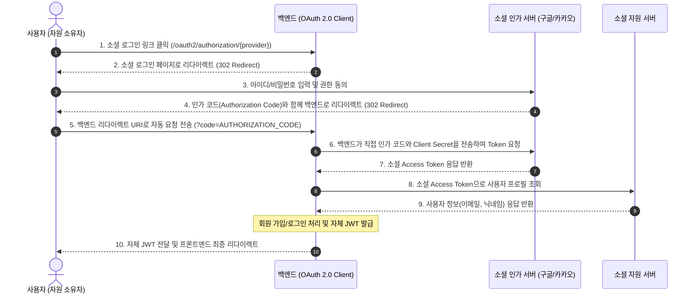

## **7. Access Token과 Refresh Token 이중화 운영 전략**

### **7.1 무상태 토큰 환경의 보안과 편의성 트레이드오프**

- 단일 토큰 운영의 한계
    - 유효기간을 길게 설정하면 토큰 탈취 시 공격자가 만료 시점까지 정상 사용자로 위장하여 시스템에 접근할 수 있으나 서버가 이를 즉시 차단하기 어려움.
    - 반대로 유효기간을 짧게 설정하면 탈취 피해는 줄일 수 있으나 사용자가 빈번하게 재로그인해야 하므로 서비스 사용성이 저하됨.
- 이중화 운영 전략: 역할과 수명이 상이한 두 종류의 토큰(Access Token, Refresh Token)을 함께 발급하여 보안성과 사용성을 상호 보완함.

### **7.2 Access Token과 Refresh Token의 특성 비교**

| **구분** | **Access Token (접근 토큰)** | **Refresh Token (재발급 토큰)** |
| --- | --- | --- |
| 주요 용도 | 보호된 API 자원에 대한 접근 권한 증명 | 만료된 Access Token의 안전한 재발급 |
| 권장 유효기간 | 30분 ~ 1시간 (단기 수명) | 7일 ~ 14일 (장기 수명) |
| HTTP 전송 빈도 | 모든 비즈니스 API 요청마다 전송 (노출 빈도 높음) | Access Token 만료 시 재발급 엔드포인트로만 전송 (노출 빈도 낮음) |
| 클라이언트 저장소 | 브라우저 메모리, 프론트엔드 상태 변수 | HttpOnly Secure 쿠키, 안전한 비공개 스토리지 |
| 탈취 시 대응 | 짧은 만료 시간으로 악용 가능 시간 최소화 | 서버 측 화이트리스트/블랙리스트 검증을 통한 강제 무효화 |

### **7.3 토큰 이중화 라이프사이클 흐름**

1. 인증 및 토큰 동시 발급
    - 클라이언트가 로그인에 성공하면 서버는 짧은 수명의 Access Token과 긴 수명의 Refresh Token을 함께 생성하여 응답.
2. 일반 자원 인가 요청
    - 클라이언트는 일반 비즈니스 API 호출 시 헤더(`Authorization: Bearer <accessToken>`)에 Access Token만 실어 전송하며, 서버는 세션 조회 없이 서명 유효성만을 즉시 검증해서 사용자 인증.
3. 만료 감지 및 자동 재발급
    - Access Token이 만료되어 서버로부터 401 오류를 수신하면, 클라이언트는 백그라운드에서 Refresh Token을 재발급 엔드포인트(`POST /api/v1/auth/refresh`)로 전송하여 새 Access Token과 갱신된 Refresh Token을 수령함. 지속적인 서비스 이용 시 만료일이 연장되어 로그인 상태가 유지됨.
4. 세션 완전 만료 및 재인증
    - 장기(7일 이상) 미접속으로 Refresh Token 유효기간이 초과되었거나 비정상 접근으로 차단된 경우에만 클라이언트는 저장된 토큰을 비우고 로그인 화면으로 이동시켜 재인증을 요구함.

### **7.4 Refresh Token 회전(RTR - Refresh Token Rotation) 전략**

- Access Token 만료 시 새 Access Token뿐만 아니라 새 Refresh Token도 함께 발급하고 기존 Refresh Token은 즉시 폐기 처리함.
- 이미 사용되어 무효화된 이전 Refresh Token으로 재발급을 시도하는 비정상 접근이 감지되면, 토큰 탈취 상태로 판별하여 해당 사용자의 모든 활성 토큰을 강제 만료시킴.

### **7.5 토큰 재발급 요청 DTO 정의 (RefreshTokenRequest)**

- 클라이언트가 만료된 Access Token 대신 전송하는 Refresh Token 수신용 DTO.
- 토큰 재발급 요청 DTO (src/main/java/net/likelion/bebc25/sns/dto/RefreshTokenRequest.java)

    ```java
    package net.likelion.bebc25.sns.dto;
    
    import jakarta.validation.constraints.NotBlank;
    
    public record RefreshTokenRequest(
        @NotBlank(message = "Refresh Token은 필수입니다.")
        String refreshToken
    ) {}
    ```


## **8. AuthRestController 토큰 갱신 엔드포인트 구현 (POST /api/v1/auth/refresh)**

- `POST /api/v1/auth/refresh` 엔드포인트를 열어 Refresh Token의 서명과 만료 여부를 검증하고, 유효한 경우 최신 사용자 정보를 바탕으로 새 Access Token 및 Refresh Token을 재발급함.
- Refresh Token 회전(RTR) 전략에 따라 토큰 갱신 시마다 새 Refresh Token도 함께 발급하여 전달함.
- 토큰 검증 실패 시 인증 예외(`BadCredentialsException`)를 던져 전역 예외 처리기(`GlobalRestExceptionHandler`)가 표준 `ApiErrorResponse`(401 Unauthorized) 규격으로 일괄 응답하도록 처리함.

### **8.1 GlobalRestExceptionHandler 인증 예외 핸들러 추가 (src/main/java/net/likelion/bebc25/sns/exception/GlobalRestExceptionHandler.java)**

- 인증 실패 및 유효하지 않은 자격 증명 관련 예외(`AuthenticationException`)를 가로채어 HTTP 401 표준 에러 응답을 반환하도록 핸들러 메서드 추가.

    ```java
    // 인증 실패 또는 유효하지 않은 자격 증명 예외 처리 (401 Unauthorized 응답)
    @ExceptionHandler(AuthenticationException.class)
    public ResponseEntity<ApiErrorResponse> handleAuthenticationException(AuthenticationException ex) {
        ApiErrorResponse response = ApiErrorResponse.of(ErrorCode.UNAUTHORIZED_ACCESS, ex.getMessage());
        return ResponseEntity.status(ErrorCode.UNAUTHORIZED_ACCESS.getHttpStatus()).body(response);
    }
    ```


### **8.2 AuthRestController 토큰 갱신 엔드포인트 구현 (src/main/java/net/likelion/bebc25/sns/controller/AuthRestController.java)**

- 토큰 갱신 컨트롤러 코드 추가

    ```java
    private final MemberMapper memberMapper;
    
    // Refresh Token 기반 Access Token 갱신 엔드포인트
    @PostMapping("/refresh")
    public ResponseEntity<TokenResponse> refresh(@RequestBody @Valid RefreshTokenRequest request) {
        String refreshToken = request.refreshToken();
    
        // 1. Refresh Token 서명 및 만료 유효성 검증
        if (!jwtProvider.validateToken(refreshToken)) {
            throw new BadCredentialsException("유효하지 않거나 만료된 Refresh Token입니다.");
        }
    
        // 2. 토큰 페이로드에서 회원 PK 추출
        Long memberId = jwtProvider.getMemberId(refreshToken);
    
        // 3. 데이터베이스 회원 존재 여부 및 최신 정보 조회
        Member member = memberMapper.findById(memberId);
        if (member == null) {
            throw new NoSuchElementException("존재하지 않는 회원입니다.");
        }
    
        // 4. 새 Access Token 및 Refresh Token 발급 (RTR 전략 적용)
        String newAccessToken = jwtProvider.createAccessToken(member.getId(), member.getEmail(), member.getRole());
        String newRefreshToken = jwtProvider.createRefreshToken(member.getId());
    
        TokenResponse response = TokenResponse.of(newAccessToken, newRefreshToken, 3600L);
        return ResponseEntity.ok(response);
    }
    ```


## **9. 토큰 갱신 파이프라인 검증 (Bruno)**

- Bruno를 활용하여 Refresh Token 기반 토큰 재발급 흐름과 위변조 차단 동작을 검증함.

### **9.1 정상 Refresh Token을 통한 새 Access Token 재발급 검증**

- Request Name: Access Token 재발급
- 호출 메서드 및 URL: `POST http://localhost:8080/api/v1/auth/refresh`
- 요청 Headers: `Content-Type: application/json`
- 요청 Body (JSON)

    ```json
    {
      "refreshToken": "{{refreshToken}}"
    }
    ```

- 검증 결과: 상태 코드 `200 OK`와 함께 새로 발급된 `accessToken` 및 `refreshToken`이 정상 응답됨.

    ```json
    {
      "accessToken": "eyJhbGciOiJIUzI1NiIsInR5cCI6IkpXVCJ9...",
      "refreshToken": "eyJhbGciOiJIUzI1NiIsInR5cCI6IkpXVCJ9...",
      "tokenType": "Bearer",
      "expiresIn": 3600
    }
    ```


### **9.2 변조되거나 만료된 Refresh Token 전송 시 차단 검증**

- Request Name: Access Token 재발급
- 호출 메서드 및 URL: `POST http://localhost:8080/api/v1/auth/refresh`
- 요청 Body (JSON)

    ```json
    {
      "refreshToken": "invalid.refresh.token"
    }
    ```

- 검증 결과: `validateToken` 검증 실패로 인해 `401 Unauthorized` 상태 코드가 반환되며 재발급이 안전하게 차단됨.

# **OAuth 2.0 소셜 로그인 연동**

## **1. OAuth(Open Authorization) 2.0 프로토콜**

- OAuth 2.0(Open Authorization 2.0)은 사용자가 별도의 복잡한 회원가입 절차 없이 구글·카카오 등의 소셜 계정으로 서비스에 간편하게 로그인할 수 있도록 지원하는 업계 표준 인가(Authorization) 프로토콜.
- 애플리케이션이 사용자의 소셜 계정 비밀번호를 직접 전달받거나 보관하지 않고, 소셜 플랫폼(구글, 카카오 등)의 공식 인증을 거쳐 사용자가 허용한 기본 프로필(이메일, 닉네임 등) 조회 권한만을 안전하게 위임받아 회원 가입 및 로그인을 처리함.

### **1.1 OAuth 2.0 프로토콜 4대 참여 주체**

- 자원 소유자(Resource Owner): 구글·카카오 등 소셜 플랫폼 계정을 소유하고 있으며, 자신의 프로필 자원에 대한 접근 권한을 위임하는 실제 최종 사용자.
- 클라이언트(Client): 사용자의 권한을 위임 받아 소셜 플랫폼에 인증 및 프로필 조회를 요청하는 백엔드 애플리케이션.
- 인가 서버(Authorization Server): 사용자의 신원을 인증하고 클라이언트에게 접근 권한 토큰(Access Token)을 발급해 주는 소셜 플랫폼 인증 서버 (Google OAuth, Kakao Auth 등).
- 자원 서버(Resource Server): 사용자의 프로필 데이터(이메일, 닉네임, 프로필 사진 등)를 보관하고 있으며, 유효한 토큰을 제시받았을 때 해당 자원을 제공해 주는 소셜 플랫폼 API 서버.

### **1.2 Authorization Code Grant Type 인가 코드 승인 방식 단계별 흐름**



## **2. build.gradle 의존성 추가 (build.gradle)**

- Spring Security는 `spring-boot-starter-oauth2-client` 의존성을 통해 위 복잡한 10단계 댄스(OAuth Dance) 과정을 표준화된 설정만으로 자동 처리해 줌.

```
dependencies {
    implementation 'org.springframework.boot:spring-boot-starter-oauth2-client'
}
```

## **3. 구글 OAuth 2.0 소셜 로그인 연동 (기본 공급자)**

### **3.1 OAuth 2.0 연동에 필요한 핵심 정보**

#### **1) 클라이언트 자격증명 정보 (Client Registration)**

- 클라이언트 ID(Client ID): 소셜 인가 서버가 우리 애플리케이션을 고유하게 식별하기 위해 발급하는 공개 식별자.
- 클라이언트 보안 비밀번호(Client Secret): 인가 코드를 액세스 토큰으로 교환할 때 우리 백엔드 서버임을 증명하는 비밀 암호키 (외부 노출 금지).
- 승인된 리디렉션 URI(Authorized Redirect URI): 사용자가 로그인 및 동의를 마쳤을 때 소셜 인가 서버가 인가 코드를 전달해 줄 백엔드 콜백 엔드포인트 URL.
    - Spring Security 기본 콜백 규칙: `{baseUrl}/login/oauth2/code/{registrationId}` (예: `http://localhost:8080/login/oauth2/code/google`)
- 접근 범위(Scope): 소셜 사용자 계정에서 조회 권한을 요청할 정보 항목 (`openid`, `profile`, `email` 등).

#### **2) 공급자 엔드포인트 URL 정보 (OAuth2 Provider)**

- 인가 요청 URI(authorization-uri): 사용자가 소셜 로그인 화면을 열고 계정 인증 및 정보 제공 동의를 수행하는 인가 서버 엔드포인트.
- 토큰 발급 URI(token-uri): 백엔드 서버가 인가 코드를 전달하고 프로필 조회용 소셜 액세스 토큰을 발급받는 엔드포인트.
- 사용자 정보 조회 URI(user-info-uri): 발급받은 소셜 액세스 토큰을 전송하여 사용자의 프로필 JSON 데이터를 조회해 오는 엔드포인트.
- 사용자 식별 속성명(user-name-attribute): 프로필 JSON 응답에서 사용자를 유일하게 식별하는 기본 키 속성 이름 (Google은 `sub`, GitHub은 `id`, Kakao는 `id`).

#### **3) 스프링 시큐리티의 기본 공급자와 서드파티 공급자 구분**

- 기본 공급자(CommonOAuth2Provider): 구글(Google), 깃허브(GitHub), 페이스북(Facebook), 옥타(Okta)는 스프링 시큐리티 내부의 `CommonOAuth2Provider` 열거형에 위 4대 프로바이더 URL 및 기본 속성이 사전 내장되어 있음. 따라서 별도의 `provider` 선언 없이 클라이언트 등록 정보(`registration`)만 선언하면 즉시 연동됨.
- 서드파티 공급자(Custom Provider): 카카오(Kakao), 네이버(Naver) 등 국내 소셜 서비스는 스프링 기본 제공자 목록에 포함되어 있지 않으므로, `registration`뿐만 아니라 위 4대 공급자 엔드포인트 URL을 `provider` 블록에 직접 명시해야 함.

### **3.2 보안 설정 분리와 application-oauth.yaml 생성**

- `client-secret`과 같은 자격증명은 GitHub 원격 저장소에 노출되면 악의적인 도용뿐만 아니라 구글 시크릿 스캐너에 의해 키가 즉시 강제 폐기될 수 있음.
- 따라서 민감 정보만 전담 보관하는 `src/main/resources/application-oauth.yaml` 파일을 별도로 생성하고 `.gitignore`에 등록하여 깃 버전 관리에서 제외.
- 메인 설정 파일(`src/main/resources/application.yaml`)에서는 `spring.config.import` 선언을 통해 해당 파일이 로컬에 존재할 때만 선택적으로 불러오도록(optional) 설정.

#### **1) .gitignore 파일에 OAuth 설정 제외 추가 (.gitignore)**

```
### OAuth Secret ###
application-oauth.yaml
```

#### **2) 메인 application.yaml에 외부 설정 import 추가 (src/main/resources/application.yaml)**

```yaml
spring:
  config:
    import: optional:application-oauth.yaml
```

#### **3) application-oauth.yaml 구글 클라이언트 템플릿 생성 (src/main/resources/application-oauth.yaml)**

- 구글은 스프링 부트에 내장된 기본 제공자이므로 별도의 공급자 엔드포인트 URL 정보는 등록할 필요 없음.

```yaml
spring:
  security:
    oauth2:
      client:
        registration:
          google:
            client-id: YOUR_GOOGLE_CLIENT_ID
            client-secret: YOUR_GOOGLE_CLIENT_SECRET
            scope:
              - profile
              - email
            redirect-uri: "{baseUrl}/login/oauth2/code/{registrationId}"
```

- 주요 설정 속성 분석
    - `client-id`: 구글 클라우드 콘솔에서 발급받은 클라이언트 식별자.
    - `client-secret`: 클라이언트 인증용 비밀키. 인가 코드를 토큰으로 교환할 때 사용됨.
    - `scope`: 구글에 접근 권한을 위임받고자 하는 정보 범위. OpenID Connect 표준에 따라 `profile`, `email`을 지정함.
    - `redirect-uri`: 구글 인가 서버가 인가 코드를 전달할 백엔드 콜백 엔드포인트. `{baseUrl}`은 서버 주소(`http://localhost:8080`), `{registrationId}`는 `google`로 자동 치환됨.

### **3.3 구글 OAuth 2.0 클라이언트 자격증명 획득 및 등록**

#### **1) Google Cloud 콘솔 접속 및 프로젝트 생성**

- Google Cloud 콘솔(`https://console.cloud.google.com/`)에 로그인한 후 좌측 상단 '프로젝트 선택' 에서 '새 프로젝트'를 클릭하여 프로젝트를 생성 (예: `sns-service`).

#### **2) 구글 인증 플랫폼 구성**

- 좌측 네비게이션 메뉴에서 'API 및 서비스' > 'OAuth 동의 화면' 선택.
- 구글 인증 플랫폼 구성 화면이 나오면 '시작하기' 버튼 클릭
- 앱 정보: 앱 이름(예: `mybatis-sns`), 사용자 지원 이메일(본인 이메일), 개발자 연락처 정보(본인 이메일)를 입력하고 '다음' 선택.
- 대상: 개인 개발 및 실습 목적이므로 '외부(External)'를 선택한 후 '다음' 선택.
- 연락처 정보: 본인 이메일 입력 후 '다음' 선택
- Google API 서비스 정책에 동의 체크 후 '계속' 선택
- '만들기' 선택

#### **3) OAuth 클라이언트 구성**

- 'OAuth 클라이언트 만들기' 선택
- 애플리케이션 유형: '웹 애플리케이션' 선택
- 이름: 클라이언트 식별 명칭 입력 (예: `Spring Boot Security Client`).
- 승인된 자바스크립트 원본: `http://localhost:8080` 추가.
- 승인된 리디렉션 URI: `http://localhost:8080/login/oauth2/code/google` 추가
- '만들기' 선택

#### **4) 클라이언트 ID와 보안 비밀번호 확인 및 application-oauth.yaml에 복사**

- 생성이 완료되면 팝업 창에 '클라이언트 ID'와 '클라이언트 보안 비밀번호'가 발급됨.
- 이를 복사하여 `src/main/resources/application-oauth.yaml` 파일의 `client-id`와 `client-secret` 값에 각각 붙여넣음.

### **3.4 구글 프로필 응답 JSON 구조 분석**

- 구글의 사용자 정보 엔드포인트는 다음과 같은 단순 1차원 평면 구조로 프로필 데이터를 반환함.
- 최상위 레벨에 `email`과 `name` 속성이 직접 위치하므로, `attributes.get("email")`과 `attributes.get("name")`으로 곧바로 추출할 수 있음.

```json
{
  "sub": "1092837465918273645",
  "name": "하루",
  "email": "haru@gmail.com",
  "picture": "https://lh3.googleusercontent.com/..."
}
```

### **3.5 신규 회원 자동 저장을 위한 MemberMapper 확장**

- 구글 인가 서버는 인증 완료 후 사용자 프로필 JSON만 전달할 뿐 자체 DB(`member` 테이블)에 사용자를 자동 저장해 주지 않음.
- 따라서 최초 소셜 로그인 사용자를 데이터베이스에 영속화하기 위해 매퍼 인터페이스와 매퍼 XML을 확장.

#### **1) MemberMapper 인터페이스에 추가 (src/main/java/net/likelion/bebc25/sns/mapper/MemberMapper.java)**

```java
// 신규 회원 등록 (소셜 로그인 자동 회원가입)
int save(Member member);
```

#### **2) MemberMapper XML 매퍼 수정 (src/main/resources/mapper/MemberMapper.xml)**

- `useGeneratedKeys="true"`와 `keyProperty="id"`를 선언하여 데이터베이스가 자동 생성한 회원 PK(`id`)가 `Member` 객체에 채워지도록 설정.

```xml
<!-- 신규 회원 등록 (소셜 로그인 자동 회원가입) -->
<insert id="save" parameterType="net.likelion.bebc25.sns.domain.Member" useGeneratedKeys="true" keyProperty="id">
    INSERT INTO member (email, password, nickname, role, created_at)
    VALUES (#{email}, COALESCE(#{password}, ''), #{nickname}, #{role}, NOW())
</insert>
```

### **3.6 통합 인증 주체를 위한 CustomUserDetails 확장**

- 폼 로그인 및 JWT 필터 검증에서는 Spring Security의 `UserDetails`에 사용자 정보를 보관했지만 OAuth 2.0 에서는 `OAuth2User`를 사용함.
- `CustomUserDetails`에 `OAuth2User` 인터페이스를 추가적으로 구현하도록 확장하면, 일반 로그인 사용자든 소셜 로그인 사용자든 `SecurityContext` 내의 인증 주체(`authentication.getPrincipal()`)를 단일한 `CustomUserDetails` 타입으로 통합 관리할 수 있음.
- CustomUserDetails 수정: `src/main/java/net/likelion/bebc25/sns/security/principal/CustomUserDetails.java`

    ```java
    // 1. OAuth2User 인터페이스 다중 구현 선언 추가
    public class CustomUserDetails implements UserDetails, OAuth2User {
    
        private final Member member;
        private final Map<String, Object> attributes; // 소셜 프로필 속성 보관 필드 추가
    
        // 일반 폼 로그인 및 JWT 필터용 생성자
        public CustomUserDetails(Member member) {
            this.member = member;
            this.attributes = Collections.emptyMap();
        }
    
        // OAuth 2.0 소셜 로그인용 신규 생성자 추가
        public CustomUserDetails(Member member, Map<String, Object> attributes) {
            this.member = member;
            this.attributes = attributes;
        }
    
        // ... 기존 UserDetails 구현 메서드 ...
    
        // 2. OAuth2User 인터페이스 구현 메서드 추가
        @Override
        public Map<String, Object> getAttributes() {
            return attributes;
        }
    
        @Override
        public String getName() {
            return member.getEmail();
        }
    }
    ```


### **3.7 구글 CustomOAuth2UserService 구현**

- `DefaultOAuth2UserService`를 상속받아 구글 인가 서버로부터 전달받은 사용자 정보(`OAuth2UserRequest`)를 파싱.
- 구글 프로필 응답 속성에서 `email`과 `name`을 추출한 뒤, DB 조회 결과 신규 회원이면 자동 회원가입을 수행.
- 최종적으로 도메인 엔티티를 품은 통합 인증 객체 `CustomUserDetails(member, attributes)`를 생성하여 반환.
- 반환된 `CustomUserDetails` 객체는 스프링 시큐리티의 상위 필터(`OAuth2LoginAuthenticationFilter`)에 의해 최종 인증 토큰(`OAuth2AuthenticationToken`)의 Principal로 포장되어 `SecurityContext`에 자동 등록됨.
- CustomOAuth2UserService 작성: `src/main/java/net/likelion/bebc25/sns/security/oauth/CustomOAuth2UserService.java`

    ```java
    package net.likelion.bebc25.sns.security.oauth;
    
    import lombok.extern.slf4j.Slf4j;
    import net.likelion.bebc25.sns.domain.Member;
    import net.likelion.bebc25.sns.mapper.MemberMapper;
    import net.likelion.bebc25.sns.security.principal.CustomUserDetails;
    import org.springframework.security.oauth2.client.userinfo.DefaultOAuth2UserService;
    import org.springframework.security.oauth2.client.userinfo.OAuth2UserRequest;
    import org.springframework.security.oauth2.core.OAuth2AuthenticationException;
    import org.springframework.security.oauth2.core.user.OAuth2User;
    import org.springframework.stereotype.Service;
    import org.springframework.transaction.annotation.Transactional;
    
    import java.util.Map;
    
    @Slf4j
    @Service
    public class CustomOAuth2UserService extends DefaultOAuth2UserService {
    
        private final MemberMapper memberMapper;
    
        public CustomOAuth2UserService(MemberMapper memberMapper) {
            this.memberMapper = memberMapper;
        }
    
        @Override
        @Transactional
        public OAuth2User loadUser(OAuth2UserRequest userRequest) throws OAuth2AuthenticationException {
            // 1. 스프링 기본 구현체를 통해 구글 UserInfo 엔드포인트에서 프로필 JSON 정보 조회
            OAuth2User oAuth2User = super.loadUser(userRequest);
    
            // 2. 구글 응답 JSON 속성 획득 (단순 1차원 구조)
            Map<String, Object> attributes = oAuth2User.getAttributes();
            log.info("구글 OAuth2 사용자 프로필 속성: {}", attributes);
            String email = (String) attributes.get("email");
            String nickname = (String) attributes.get("name");
    
            // 3. DB 조회 후 최초 로그인이면 자동 회원가입 진행
            Member member = saveOrUpdate(email, nickname);
    
            // 4. 통합 인증 주체 반환
            return new CustomUserDetails(member, attributes);
        }
    
        private Member saveOrUpdate(String email, String nickname) {
            Member existingMember = memberMapper.findByEmail(email);
            if (existingMember == null) {
                Member newMember = Member.builder()
                        .email(email)
                        .password("") // 소셜 회원은 자체 비밀번호가 없으므로 빈 문자열 저장
                        .nickname(nickname)
                        .role("ROLE_USER")
                        .build();
                memberMapper.save(newMember);
                log.info("신규 구글 소셜 회원 DB 자동 가입 완료: ID={}, Email={}", newMember.getId(), newMember.getEmail());
                return newMember;
            }
            return existingMember;
        }
    }
    ```


### **3.8 OAuth2SuccessHandler 구현 및 JWT 발급 연동**

- 소셜 인증 성공 핸들러의 역할과 SPA 연동 메커니즘
    - Spring Security의 기본 소셜 로그인은 인증이 성공하면 세션을 생성하고 `JSESSIONID` 쿠키를 발급하지만, 모바일 앱이나 React, Vue SPA 환경에서는 무상태(Stateless) REST API 아키텍처를 채택함.
    - 인증 성공 핸들러에서는 `authentication.getPrincipal()`을 호출해서 `UserDetails` 객체를 꺼내고 `userDetails.getMember()`로 `Member` 객체를 추출할 수 있음.
    - 회원 식별자(PK), 이메일, 역할을 이용해서 자체 JWT(`accessToken`)를 발급.
    - 발급된 JWT 토큰을 프론트엔드가 결과를 수신할 콜백 URL의 쿼리 스트링 파라미터로 조립한 후, 브라우저를 프론트엔드 콜백 URL로 리다이렉트(302 Redirect)시켜 토큰을 전달.
- OAuth2SuccessHandler 작성: `src/main/java/net/likelion/bebc25/sns/security/handler/OAuth2SuccessHandler.java`

    ```java
    package net.likelion.bebc25.sns.security.handler;
    
    import jakarta.servlet.http.HttpServletRequest;
    import jakarta.servlet.http.HttpServletResponse;
    import lombok.extern.slf4j.Slf4j;
    import net.likelion.bebc25.sns.domain.Member;
    import net.likelion.bebc25.sns.security.jwt.JwtProvider;
    import net.likelion.bebc25.sns.security.principal.CustomUserDetails;
    import org.springframework.security.core.Authentication;
    import org.springframework.security.web.authentication.SimpleUrlAuthenticationSuccessHandler;
    import org.springframework.stereotype.Component;
    import org.springframework.web.util.UriComponentsBuilder;
    
    import java.io.IOException;
    
    @Slf4j
    @Component
    public class OAuth2SuccessHandler extends SimpleUrlAuthenticationSuccessHandler {
    
        private final JwtProvider jwtProvider;
    
        public OAuth2SuccessHandler(JwtProvider jwtProvider) {
            this.jwtProvider = jwtProvider;
        }
    
        @Override
        public void onAuthenticationSuccess(HttpServletRequest request, HttpServletResponse response,
                                            Authentication authentication) throws IOException {
            // 1. CustomOAuth2UserService에서 반환한 통합 인증 객체 및 Member 엔티티 추출
            CustomUserDetails userDetails = (CustomUserDetails) authentication.getPrincipal();
            Member member = userDetails.getMember();
    
            log.info("OAuth2 인증 성공 처리 시작: MemberId={}, Email={}", member.getId(), member.getEmail());
    
            // 2. 백엔드 서비스 전용 자체 JWT 액세스 토큰 생성
            String accessToken = jwtProvider.createAccessToken(member.getId(), member.getEmail(), member.getRole());
    
            // 3. 정적 콜백 페이지 URI 구성 (쿼리 파라미터로 액세스 토큰 전달)
            String targetUrl = UriComponentsBuilder.fromPath("/oauth/callback.html")
                    .queryParam("accessToken", accessToken)
                    .build().toUriString();
    
            log.info("정적 콜백 페이지 리다이렉트 수행: {}", targetUrl);
    
            // 4. 콜백 URL로 브라우저 302 리다이렉트 실행
            getRedirectStrategy().sendRedirect(request, response, targetUrl);
        }
    }
    ```


### **3.9 SecurityConfig에 OAuth 2.0 로그인 등록**

- 구현한 `CustomOAuth2UserService`와 `OAuth2SuccessHandler`를 스프링 시큐리티 필터 체인에 등록하고, 브라우저 테스트용 정적 HTML 자원에 대한 인가 예외를 추가.
- SecurityConfig 수정: `src/main/java/net/likelion/bebc25/sns/config/SecurityConfig.java`

    ```java
    @Bean
    public SecurityFilterChain filterChain(HttpSecurity http) throws Exception {
        http
            // ... 기존 CSRF, CORS, 세션 무상태 설정 유지 ...
            .authorizeHttpRequests(auth -> auth
                // 소셜 로그인 테스트용
                .requestMatchers("login.html", "/favicon.ico", "/oauth/**").permitAll()
                ...
            )
            .oauth2Login(oauth2 -> oauth2
                // 1. 소셜 사용자 프로필 조회 및 DB 저장 커스텀 서비스 등록
                .userInfoEndpoint(userInfo -> userInfo
                    .userService(customOAuth2UserService)
                )
                // 2. 소셜 인증 성공 후 자체 JWT 발급 및 프론트엔드 리다이렉트 핸들러 등록
                .successHandler(oAuth2SuccessHandler)
            );
    
        return http.build();
    }
    ```


### **3.10 구글 소셜 로그인 전체 흐름 검증 (브라우저 실습)**

- 애플리케이션 기동 후 브라우저를 통해 구글 소셜 로그인이 정상적으로 동작하고 최종 JWT 토큰이 발급되는지 검증함.
- 테스트용 정적 로그인 HTML 페이지 작성 (`src/main/resources/static/login.html`)
    - 스프링 부트는 `src/main/resources/static/` 경로에 위치한 정적 HTML 리소스를 서빙하므로, `http://localhost:8080/login.html` 경로로 접속.
    - 로그인 진입 엔드포인트: `/oauth2/authorization/google` (사용자가 클릭하여 소셜 인가 절차를 시작하는 진입 URL)

```html
<!doctype html>
<html lang="ko">
<head>
  <meta charset="UTF-8">
  <meta name="viewport" content="width=device-width, initial-scale=1">
  <title>소셜 로그인 실습 테스트</title>
</head>
<body>
  <h1>소셜 로그인 실습 테스트</h1>
  <!-- 구글 소셜 로그인 인가 요청 시작 링크 -->
  <a href="/oauth2/authorization/google">구글 로그인</a>
</body>
</html>
```

- 토큰 수신용 정적 콜백 HTML 작성 (`src/main/resources/static/oauth/callback.html`)
    - 백엔드의 `OAuth2SuccessHandler`가 발급한 자체 JWT(`accessToken`)를 URL 쿼리 파라미터로 전달받아 화면에 출력하고 보관하는 테스트 페이지.

```html
<!doctype html>
<html lang="ko">
<head>
  <meta charset="UTF-8">
  <meta name="viewport" content="width=device-width, initial-scale=1">
  <title>소셜 로그인 콜백 테스트</title>
  <style>
    body { font-family: sans-serif; padding: 20px; line-height: 1.6; }
    .token-box { background: #f4f4f4; border: 1px solid #ddd; padding: 15px; border-radius: 6px; word-break: break-all; margin-top: 10px; font-family: monospace; }
  </style>
</head>
<body>
  <h1>소셜 로그인 성공!</h1>
  <p>백엔드에서 발급되어 URL 쿼리 파라미터로 전달된 JWT 액세스 토큰입니다:</p>
  <div id="token" class="token-box">토큰 확인 중...</div>

  <script>
    // 1. URL 쿼리 파라미터에서 accessToken 추출
    const params = new URLSearchParams(window.location.search);
    const accessToken = params.get('accessToken');

    // 2. 화면 출력 및 로컬 스토리지 보관
    if (accessToken) {
      document.getElementById('token').innerText = accessToken;
      localStorage.setItem('accessToken', accessToken);
      console.log('발급된 JWT Access Token:', accessToken);
    } else {
      document.getElementById('token').innerText = '전달된 accessToken이 없습니다.';
    }
  </script>
</body>
</html>
```

- 단계별 실습 절차
    - 1단계: 스프링 부트 애플리케이션을 기동하고 웹 브라우저에서 `http://localhost:8080/login.html`에 접속.
    - 2단계: 화면에 렌더링된 '구글 로그인' 링크(`href="/oauth2/authorization/google"`)를 클릭함.
    - 3단계: 백엔드의 `OAuth2AuthorizationRequestRedirectFilter`에 의해 구글 공식 로그인 화면(`https://accounts.google.com/...`)으로 302 리다이렉트됨을 확인.
    - 4단계: 구글 계정으로 로그인하고, 프로필/이메일 정보 제공에 동의함.
    - 5단계: 구글 인가 서버가 브라우저를 백엔드 콜백 주소(`http://localhost:8080/login/oauth2/code/google?code=...`)로 자동 리다이렉트시킴.
    - 6단계: 백엔드가 인가 코드를 구글 Access Token으로 자동 교환한 뒤 `CustomOAuth2UserService`를 실행하여 DB `member` 테이블에 사용자를 자동 가입(INSERT)시킴.
    - 7단계: `OAuth2SuccessHandler`가 자체 JWT(`accessToken`)를 발급하고, 브라우저를 정적 콜백 페이지로 최종 이동시킴을 주소창에서 확인.
    - 8단계: 콜백 화면에 정상적으로 출력된 JWT 토큰(`accessToken`)을 확인.
- 테스트 완료 후 구글 계정 연동 해제(동의 철회) 방법
    - 소셜 로그인 최초 동의 화면이나 DB 자동 회원가입 흐름을 반복해서 재현·테스트하려면 구글 계정에 등록된 앱 연동 권한을 해제해야 함.
    - 구글 연동 앱 관리 페이지: `https://myaccount.google.com/linkedapps`
    - 단계별 해제 절차
        - 1단계: 웹 브라우저에서 구글 계정의 연동된 앱 관리 페이지(`https://myaccount.google.com/linkedapps`)로 이동.
        - 2단계: '서드 파티 앱 및 서비스' 목록에서 실습 중 등록한 애플리케이션(예: GCP OAuth 동의 화면에 입력한 앱 이름)을 선택.
        - 3단계: '모두 삭제' 버튼을 클릭하여 연동을 해제.
        - 4단계: 데이터베이스의 `member` 테이블에서 테스트 계정을 삭제(`DELETE FROM member WHERE email = '...';`)한 후 다시 로그인하면 최초 동의 화면 및 자동 가입 전체 흐름이 다시 재현됨.

## **4. 카카오 OAuth 2.0 확장 및 커스텀 공급자 연동 (서드파티 확장)**

- 카카오(Kakao)는 구글과 달리 스프링 시큐리티 내부의 `CommonOAuth2Provider` 기본 제공자 목록에 포함되어 있지 않은 서드파티 공급자.
- 따라서 클라이언트 등록 정보(`registration`)뿐만 아니라 인가, 토큰 발급, 사용자 프로필 조회 엔드포인트 URL을 정의하는 `provider` 설정을 직접 명시해야 함.
- 또한 프로필 응답 JSON이 다중 중첩 구조로 제공되므로 파싱 로직을 확장하고, 개인 개발자 환경에서 발생할 수 있는 이메일 미제공 상황에 대비한 방어 로직을 구현이 필요함.

### **4.1 카카오 커스텀 provider 규격과 application-oauth.yaml 확장 (src/main/resources/application-oauth.yaml)**

```yaml
spring:
  security:
    oauth2:
      client:
        registration:
          google:
            ...
          kakao:
            client-id: YOUR_KAKAO_REST_API_KEY
            client-secret: YOUR_KAKAO_CLIENT_SECRET
            client-authentication-method: client_secret_post
            authorization-grant-type: authorization_code
            scope:
              - profile_nickname
              - profile_image
            redirect-uri: "{baseUrl}/login/oauth2/code/{registrationId}"
            client-name: Kakao
        provider:
          kakao:
            authorization-uri: https://kauth.kakao.com/oauth/authorize
            token-uri: https://kauth.kakao.com/oauth/token
            user-info-uri: https://kapi.kakao.com/v2/user/me
            user-name-attribute: id
```

- 주요 카카오 전용 설정 속성 분석
    - `client-authentication-method: client_secret_post`: 카카오 인가 서버에 토큰을 요청할 때 HTTP POST Body에 `client_secret`을 담아 전송하도록 지정함.
    - `authorization-grant-type: authorization_code`: 웹 브라우저 기반 인증 코드 인가 방식(Authorization Code Grant) 사용을 선언함.
    - `user-name-attribute: id`: 카카오 사용자 프로필 JSON 응답에서 사용자를 유일하게 식별하는 기본 키 속성 명칭을 `id`로 지정함.
    - `provider.kakao.*`: 스프링 시큐리티 기본 제공자가 아니므로 인가 URL, 토큰 URL, 프로필 조회 URL을 수동으로 매핑함.

### **4.2 카카오 OAuth 2.0 클라이언트 자격증명 획득 절차**

#### **1) 카카오 소셜 로그인 연동에 필요한 4가지 핵심 정보**

- REST API 키 (Client ID 역할): 카카오 인가 서버가 우리 애플리케이션을 고유하게 식별하기 위해 발급하는 공개 식별자.
- Client Secret (보안 비밀): 인가 코드를 액세스 토큰으로 교환할 때 우리 백엔드 서버임을 증명하는 비밀 암호키 (외부 노출 금지).
- 승인된 리디렉션 URI (Redirect URI): 사용자가 카카오 로그인 및 정보 제공 동의를 마쳤을 때 카카오 인가 서버가 인가 코드를 전달해 줄 백엔드 콜백 엔드포인트 URL.
    - Spring Security 기본 콜백 규칙: `http://localhost:8080/login/oauth2/code/kakao`
- 동의 항목 (Scope): 카카오 사용자 계정에서 조회 권한을 요청할 정보 항목 (`profile_nickname`, `account_email`).

#### **2) 카카오 디벨로퍼스 콘솔 발급 단계별 절차**

- 1단계: Kakao Developers 접속 및 애플리케이션 생성
    - 카카오 디벨로퍼스(https://developers.kakao.com/)에%EC%97%90) 로그인한 후 상단 '앱' > '+앱 생성' 버튼 선택.
    - 앱 이름(예: `mybatis-sns`), 회사명(예: 멋쟁이 사자처럼), 카테고리(소셜 네트워킹) 선택, 운영정책 동의 체크 후 '저장' 선택.
- 2단계: 카카오 로그인 활성화 및 Redirect URI 등록
    - 생성한 앱 선택 후 좌측 네비게이션 메뉴에서 '카카오 로그인 > 일반' 선택.
    - 사용 설정 항목의 '상태' 토글 버튼을 'ON'으로 변경.
- 3단계: 동의 항목(Scope) 설정
    - 좌측 네비게이션 메뉴에서 '카카오 로그인 > 동의항목' 선택.
    - 개인정보 항목의 닉네임 '설정' 버튼 선택
        - '선택 동의', 동의 목적: 테스트 입력 후 '저장' 버튼 선택
    - 개인정보 항목의 프로필 사진 '설정' 버튼 선택
        - '선택 동의', 동의 목적: 테스트 입력 후 '저장' 버튼 선택
- 4단계:
    - 좌측 네비게이션 메뉴에서 '앱 > 플랫폼 키' 선택.
    - REST API 키 선택
    - REST API 키를 복사해서 `src/main/resources/application-oauth.yaml` 파일의 kakao 항목 `client-id` 값에 붙여넣음.
    - 카카오 로그인 리다이렉트 URI: `http://localhost:8080/login/oauth2/code/kakao` 입력
    - 클라이이언트 시크릿 > 카카오 로그인 > 코드를 복사해서 `src/main/resources/application-oauth.yaml` 파일의 kakao 항목 `client-secret` 값에 붙여넣음.
    - '저장' 버튼 선택

### **4.3 카카오 다중 중첩 JSON 구조 및 비즈 앱 이메일 권한**

- 카카오 프로필 응답 JSON 구조

    ```json
    {
      "id": 1234567890,
      "kakao_account": {
        "email": "haru@kakao.com",
        "profile": {
          "nickname": "하루",
          "profile_image_url": "http://k.kakaocdn.net/..."
        }
      }
    }
    ```

- 구글과의 구조적 차이점
    - 구글은 최상위 계층에 `email`, `name`이 직접 위치하지만, 카카오는 최상위에 고유 식별자 `id`만 위치하고 이메일은 `kakao_account`, 닉네임은 `kakao_account.profile` 내부에 중첩되어 있음.
- 비즈 앱 이메일 필수 동의 권한 및 가상 이메일 생성
    - 카카오 디벨로퍼스에서 사업자 등록 기반의 '비즈 앱(Biz App)'으로 전환하면 이메일 수집 가능.
    - 일반 개발자 개인 계정 환경에서는 사용자 이메일(`account_email`) 수집 항목이 비활성화 되어 있음.
    - 이메일 항목이 비활성화 되어 있으면 `kakao_account.email` 값이 `null`로 반환됨.
    - Member 테이블의 `email` 컬럼이 `NOT NULL` 유니크 제약 조건을 가지고 있을 경우 데이터 무결성 위반 예외가 발생하므로, 카카오 고유 번호(`id`)를 조합한 대체 가상 이메일(`kakao_{id}@kakao.social`) 생성 로직을 추가.

### **4.4 CustomOAuth2UserService 카카오 지원 확장**

- `registrationId`("google", "kakao")에 따라 플랫폼별 상이한 JSON 구조를 분기 처리하도록 switch 문 추가.
- CustomOAuth2UserService: `src/main/java/net/likelion/bebc25/sns/security/oauth/CustomOAuth2UserService.java`

    ```java
    package net.likelion.bebc25.sns.security.oauth;
    
    import lombok.extern.slf4j.Slf4j;
    import net.likelion.bebc25.sns.domain.Member;
    import net.likelion.bebc25.sns.mapper.MemberMapper;
    import net.likelion.bebc25.sns.security.principal.CustomUserDetails;
    import org.springframework.security.oauth2.client.userinfo.DefaultOAuth2UserService;
    import org.springframework.security.oauth2.client.userinfo.OAuth2UserRequest;
    import org.springframework.security.oauth2.core.OAuth2AuthenticationException;
    import org.springframework.security.oauth2.core.user.OAuth2User;
    import org.springframework.stereotype.Service;
    import org.springframework.transaction.annotation.Transactional;
    
    import java.util.Map;
    
    @Slf4j
    @Service
    public class CustomOAuth2UserService extends DefaultOAuth2UserService {
    
        private final MemberMapper memberMapper;
    
        public CustomOAuth2UserService(MemberMapper memberMapper) {
            this.memberMapper = memberMapper;
        }
    
        @Override
        @Transactional
        public OAuth2User loadUser(OAuth2UserRequest userRequest) throws OAuth2AuthenticationException {
            // 1. 스프링 기본 구현체를 통해 소셜 UserInfo 엔드포인트에서 프로필 JSON 정보 조회
            OAuth2User oAuth2User = super.loadUser(userRequest);
    
            // 2. 현재 로그인 요청이 들어온 소셜 공급자 식별 ("google", "kakao")
            String registrationId = userRequest.getClientRegistration().getRegistrationId();
    
            // 3. 플랫폼별 응답 JSON 속성에서 회원 정보 추출 후 DB 자동 가입 또는 조회
            Map<String, Object> attributes = oAuth2User.getAttributes();
            Member member = saveOrUpdate(registrationId, attributes);
    
            // 4. 도메인 회원 엔티티와 원시 attributes를 모두 보관하는 통합 인증 주체 반환
            return new CustomUserDetails(member, attributes);
        }
    
        // 소셜 플랫폼별 상이한 JSON 구조를 분석하여 Member 엔티티로 변환 및 DB 반영
        private Member saveOrUpdate(String registrationId, Map<String, Object> attributes) {
            String email;
            String nickname;
    
            switch (registrationId.toLowerCase()) {
                case "google" -> {
                    email = (String) attributes.get("email");
                    nickname = (String) attributes.get("name");
                }
                case "kakao" -> {
                    Map<String, Object> kakaoAccount = (Map<String, Object>) attributes.get("kakao_account");
                    Map<String, Object> profile = (kakaoAccount != null) ? (Map<String, Object>) kakaoAccount.get("profile") : null;
                    email = (kakaoAccount != null) ? (String) kakaoAccount.get("email") : null;
                    nickname = (profile != null) ? (String) profile.get("nickname") : "KakaoUser";
    
                    // 카카오 비즈 앱 미전환 또는 사용자 동의 거부로 이메일이 null인 경우: 카카오 고유 id 기반 가상 이메일 생성
                    if (email == null || email.isBlank()) {
                        Object kakaoId = attributes.get("id");
                        email = "kakao_" + kakaoId + "@kakao.social";
                        log.info("카카오 이메일 미제공 계정: 대체 가상 이메일 [{}] 생성", email);
                    }
                }
                default -> throw new OAuth2AuthenticationException("지원하지 않는 소셜 로그인 공급자입니다: " + registrationId);
            }
    
            // DB에 해당 이메일의 기존 회원이 있는지 조회
            Member existingMember = memberMapper.findByEmail(email);
            if (existingMember == null) {
                // 최초 로그인인 경우 자동 회원가입 진행
                Member newMember = Member.builder()
                        .email(email)
                        .password("") // 소셜 로그인 회원은 자체 비밀번호가 없으므로 빈 문자열 저장
                        .nickname(nickname)
                        .role("ROLE_USER")
                        .build();
                memberMapper.save(newMember);
                log.info("신규 소셜 회원 DB 자동 가입 완료: ID={}, Email={}", newMember.getId(), newMember.getEmail());
                return newMember;
            }
    
            return existingMember;
        }
    }
    ```


### **4.5 카카오 소셜 로그인 전체 흐름 검증 (브라우저 실습)**

- 애플리케이션 기동 후 브라우저를 통해 카카오 소셜 로그인이 정상적으로 동작하고 최종 JWT 토큰이 발급되는지 검증.
- `src/main/resources/static/login.html` 파일에 카카오 소셜 로그인 인가 요청 시작 링크 추가.

    ```html
    <!doctype html>
    <html lang="ko">
    <head>
      <meta charset="UTF-8">
      <meta name="viewport" content="width=device-width, initial-scale=1">
      <title>소셜 로그인 실습 테스트</title>
    </head>
    <body>
      <h1>소셜 로그인 실습 테스트</h1>
      <!-- 구글 및 카카오 소셜 로그인 인가 요청 시작 링크 -->
      <a href="/oauth2/authorization/google">구글 로그인</a>
      <br><br>
      <a href="/oauth2/authorization/kakao">카카오 로그인</a>
    </body>
    </html>
    ```

- 애플리케이션 구동 후 웹 브라우저에서 `http://localhost:8080/login.html`에 접속해서 테스트

---

# **6. 커스텀 보안 필터 설계와 필터 체인 제어**

## **6.1 커스텀 필터 체인 설계 및 순서 제어**

- Spring Security는 약 30여 개 이상의 기본 필터들로 정교하게 구성되어 있으며, 필터 간의 순서(Order)가 매우 엄격하게 지켜져야 함.
- 순서 배치 메서드
    - `addFilterBefore(filter, targetClass)`: 기준 필터 바로 앞 순번에 커스텀 필터 배치.
    - `addFilterAfter(filter, targetClass)`: 기준 필터 바로 뒤 순번에 커스텀 필터 배치.
    - `addFilterAt(filter, targetClass)`: 기준 필터와 동일한 순서 위치에 배치 (기존 필터를 덮어쓰는 것이 아니라 순서상 동급으로 배치됨에 유의).

### **6.1.1 로깅 및 요청 감사(Audit)**

- 요청 감사(Request Audit) 정의 및 목적
    - 시스템에 인입되는 모든 HTTP 요청의 핵심 행적(누가, 언제, 어디서, 무엇을 요청했고 결과가 어떠했는지)을 사후 추적성과 보안 모니터링 목적으로 기록·보관하는 통제 절차.
    - 일반 디버깅 목적의 단순 로깅과 달리, 침해 사고 분석을 위한 포렌식 증거 확보, 비정상적 무차별 대입 공격 탐지, 정보보호 규정(ISMS, 개인정보보호법 등) 준수를 위한 보안 메타데이터 수집을 수행함.
- 수집 대상 핵심 감사 항목
    - 접속자 식별 정보: 클라이언트 실제 IP 주소(`request.getRemoteAddr()`), 접속 브라우저 정보(User-Agent), 요청자 식별자
    - 요청 일시 및 소요 시간: 요청 유입 시점, 처리 완료 시점, 총 왕복 지연 시간(Duration)
    - 요청 대상: HTTP 메서드(GET, POST 등), 요청 엔드포인트 URI
    - 처리 결과: 최종 응답 HTTP 상태 코드(200, 401, 403, 500 등)
- 서블릿 필터 계층에서 감사를 수행하는 이유
    - 인증 실패(401)나 권한 거부(403) 등으로 인해 컨트롤러(`DispatcherServlet`) 내부로 진입하지 못하고 외벽에서 차단된 비인가 공격 트래픽까지 누락 없이 수집·기록할 수 있음.
    - `OncePerRequestFilter`의 `doFilterInternal` 전처리 시점에 시작 시간을 측정하고 `finally` 블록에서 종료 시간을 산출함으로써 실제 네트워크 왕복에 가까운 전체 처리 소요 시간을 오차 없이 계측함.
- 필터 구현 (src/main/java/net/likelion/bebc25/sns/security/filter/RequestAuditFilter.java)

    ```java
    package net.likelion.bebc25.sns.security.filter;
    
    import jakarta.servlet.FilterChain;
    import jakarta.servlet.ServletException;
    import jakarta.servlet.http.HttpServletRequest;
    import jakarta.servlet.http.HttpServletResponse;
    import org.slf4j.Logger;
    import org.slf4j.LoggerFactory;
    import org.springframework.web.filter.OncePerRequestFilter;
    
    import java.io.IOException;
    
    public class RequestAuditFilter extends OncePerRequestFilter {
    
        private static final Logger log = LoggerFactory.getLogger(RequestAuditFilter.class);
    
        @Override
        protected void doFilterInternal(HttpServletRequest request, HttpServletResponse response, FilterChain filterChain)
                throws ServletException, IOException {
            long startTime = System.currentTimeMillis();
            String clientIp = request.getRemoteAddr();
            String method = request.getMethod();
            String uri = request.getRequestURI();
    
            try {
                filterChain.doFilter(request, response);
            } finally {
                long duration = System.currentTimeMillis() - startTime;
                int status = response.getStatus();
                log.info("[HTTP AUDIT] {} {} | 상태코드: {} | 소요시간: {}ms | 접속IP: {}",
                        method, uri, status, duration, clientIp);
            }
        }
    }
    ```

- 시큐리티 필터 체인 등록 (src/main/java/net/likelion/bebc25/sns/security/config/SecurityConfig.java)
    - 등록 위치: `SecurityContextHolderFilter` 이전(`addFilterBefore`)
    - 보안 컨텍스트 초기화 이전 배치 사유: 인증 실패(401 Unauthorized)나 권한 인가 거부(403 Forbidden) 등으로 인해 시큐리티 필터 체인 내부에서 즉시 차단되어 컨트롤러에 진입하지 못하는 모든 비인가 트래픽까지 누락 없이 로깅하고, 요청의 실제 인입 시점부터 서블릿 컨테이너를 빠져나갈 때까지의 전체 HTTP 처리 소요 시간을 오차 없이 계측하기 위해 보안 컨텍스트 생성·로드 이전 단계에 배치함.

    ```java
    @Bean
    public SecurityFilterChain securityFilterChain(
            HttpSecurity http,
            CustomAuthenticationEntryPoint customAuthenticationEntryPoint,
            CustomAccessDeniedHandler customAccessDeniedHandler) throws Exception {
    
        http
                // 보안 감사 필터 등록 (요청 유입 및 처리 소요 시간 계측)
                .addFilterBefore(
                        new RequestAuditFilter(),
                        SecurityContextHolderFilter.class
                )
    
                // CSRF 공격 방어 기능 비활성화
                .csrf(AbstractHttpConfigurer::disable)
    
                // HTTP 기본 인증 활성화 및 폼 로그인 비활성화
                .httpBasic(Customizer.withDefaults())
                .formLogin(AbstractHttpConfigurer::disable)
    
                // ... 기존 보안 설정 유지 ...
                .authorizeHttpRequests(auth -> auth
                        // ... 엔드포인트 접근 인가 설정 ...
                );
    
        return http.build();
    }
    ```

- 동작 검증 로그 출력 예시
    - 클라이언트 요청 인입 시 콘솔에 기록되는 감사 로그 포맷 확인. 정상 호출(200 OK)뿐만 아니라 인증 헤더 누락으로 차단된 요청(401 Unauthorized)도 온전히 계측됨.

    ```bash
    [HTTP AUDIT] GET /api/v1/posts | 상태코드: 200 | 소요시간: 16ms | 접속IP: 127.0.0.1
    [HTTP AUDIT] POST /api/v1/posts | 상태코드: 401 | 소요시간: 3ms | 접속IP: 127.0.0.1
    ```